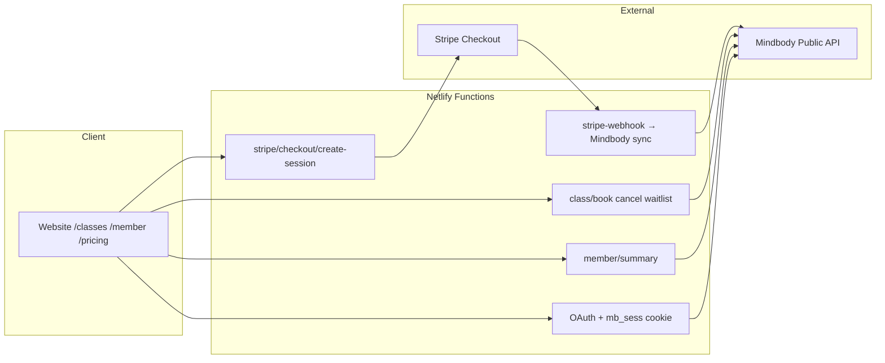
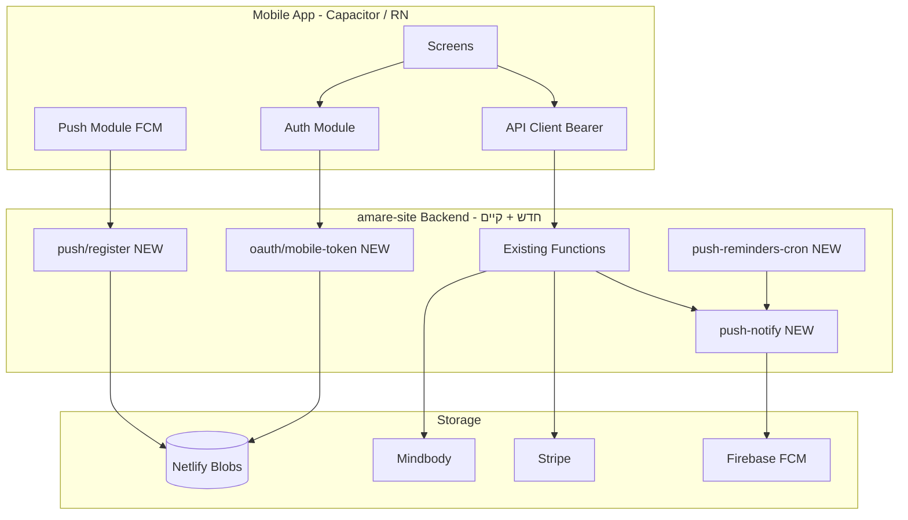
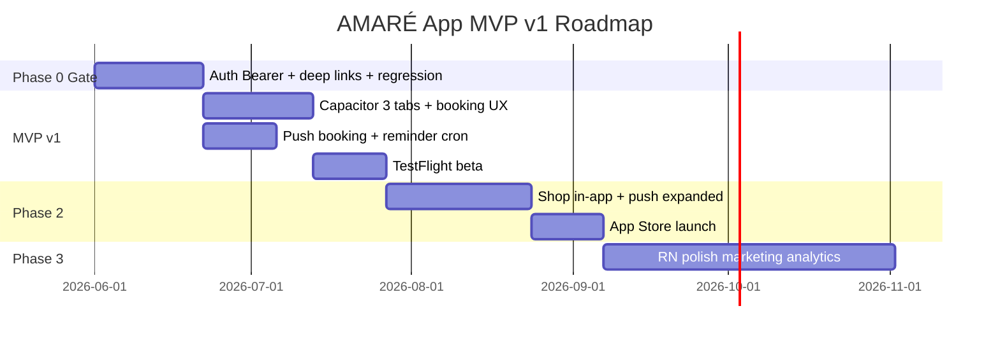

# אפליקציית AMARÉ — תוכנית מקיפה ודרכי יישום

> **Status: PLANNING** — מסמך תכנון; לא התחיל יישום.
>
> Related: [`URL-MAP.md`](./URL-MAP.md), [`MINDBODY-CHECKOUT-OVERVIEW.md`](./MINDBODY-CHECKOUT-OVERVIEW.md), [`MEMBERSHIP-RECURRING-CHECKOUT.md`](./MEMBERSHIP-RECURRING-CHECKOUT.md), [`MINDBODY-CONSUMER-STUDIO-LINK-DIAGNOSIS.md`](./MINDBODY-CONSUMER-STUDIO-LINK-DIAGNOSIS.md), [`bring-a-friend-guest-pass-plan.md`](./bring-a-friend-guest-pass-plan.md), [`EMAIL-DESIGN-SYSTEM.md`](./EMAIL-DESIGN-SYSTEM.md), [`DESIGN-SYSTEM.md`](./DESIGN-SYSTEM.md)

---

## TL;DR

- **~75% מה-backend כבר קיים** — האפליקציה = UI חדש + mobile auth + Push; לא מערכת חדשה.
- **גישה:** Capacitor + React ל-MVP v1 → TestFlight → App Store.
- **MVP v1 (מאושר ליישום):** Schedule, Book/Cancel/Waitlist, Profile בסיסי, Push (booking + reminder), **קישור ל-`/pricing`** — **לא** Shop מלא בתוך האפליקציה.
- **שער Phase 0:** mobile auth + bearer + deep links + regression על האתר — **רק אחרי שזה יציב** בונים screens.
- **זמן ריאלי:** MVP v1 מצומצם **8–10 שבועות** (מפתח שמכיר את הקוד); תוכנית מלאה **12–16 שבועות**; polished App Store **4–6 חודשים**.
- **סיכון #1:** Mobile auth + Consumer↔Studio link — אם זה לא יציב, כל האפליקציה נראית שבורה.

> **הערה:** הסעיפים 1–17 למטה מתארים גם את החזון המלא (north star). **§0 הוא היקף ה-MVP שמומלץ להתחיל ממנו.**

---

## 0. Product Review — MVP v1 (היקף מצומצם)

> סקירת מוצר (2026-06-02): התוכנית המקורית נכונה בכיוון, אבל **אופטימית מדי** בזמנים ובמורכבות Auth + Mindbody + App Store. ה-MVP צריך לפתור **בוקינג ושימור לקוחות** — לא להיות אתר מלא בתוך אפליקציה.

### 0.1 מה נכון בתוכנית

| נקודה | למה |
|--------|-----|
| Backend קיים | booking, cancel, waitlist, `member/summary`, Stripe checkout, OAuth — כבר ב-production |
| Capacitor + React | נכון ל-AMARÉ — reuse אתר React/Netlify/Mindbody/Stripe; RN רק אחרי traction |
| Stripe Hosted Checkout | נכון ל-MVP — PCI מינימלי, sync קיים; לא Payment Sheet native |
| Firebase FCM + Capacitor Push | כיוון נכון ל-iOS/Android |
| Bearer + cookie dual auth | web לא נשבר; app מקבל tokens |

### 0.2 מה מסוכן / אופטימי מדי

| נקודה | סיכון |
|--------|--------|
| **Mobile auth** | OAuth Mindbody + deep links + Apple/Google SSO — אם נשבר, הכל נשבר |
| **Studio link** | credits ≠ booking; UX ל-`client_not_linked` / `DeniedAccess` חייב להיות מושלם |
| **Shop מלא ב-MVP** | consent memberships, Stripe redirect חזרה, קטלוג — scope כפול |
| **Push כפול** | app + Mindbody email על אותו event — dedupe חובה |
| **הערכת 11–13 שבועות** | ריאלי רק למפתח שמכיר את `amare-site`; מפתח חדש → +30–50% |

### 0.3 AMARÉ App MVP v1 — In / Out

**שם פנימי:** `AMARÉ App MVP v1`

#### כולל (v1)

| # | יכולת |
|---|--------|
| 1 | Login with Mindbody (+ studio-link error states) |
| 2 | Schedule — week view, class detail, capacity |
| 3 | Book / Cancel / Waitlist (+ בחירת `clientServiceId` אם צריך) |
| 4 | Profile בסיסי — credits, membership, upcoming classes, waitlist |
| 5 | Push — **booking confirmed** + **class reminder** (cron) |
| 6 | CTA **"Buy a pass"** → פותח `/pricing` ב-browser (לא Shop tab) |

#### לא כולל (v1) — Phase 2+

- Shop / קטלוג מלא / Stripe flow בתוך האפליקציה
- Bring a Friend
- Marketing push, low credits automation
- Visit history מתקדם
- React Native migration / native screens
- Analytics dashboard
- Push: payment failed, purchase success, waitlist promoted (Phase 2)

### 0.4 Gate: Phase 0 לפני UI

**אסור** לעצב את כל האפליקציה לפני ש-Phase 0 עובר:

- [x] `mobile-exchange` + `mobile-refresh` + `mobile-revoke` — see [`AMARE-APP-PHASE0.md`](./AMARE-APP-PHASE0.md)
- [x] `resolveSessionFromRequest()` — cookie **ו**-Bearer (kill switch `ENABLE_MOBILE_BEARER_AUTH=0` default)
- [ ] Deep link OAuth callback (`amare://oauth/callback`)
- [ ] E2E: login → `member/summary` → `class/book` עם Bearer
- [ ] Regression: `/classes` + `/member` באתר עם cookie — **ללא שינוי**

רק אחרי checklist זה → Capacitor shell + 3 tabs.

### 0.5 מתי שווה לבנות (החלטה עסקית)

**כן**, אם המטרה:

- להגדיל חזרת לקוחות ו-boking ישיר
- Push reminders (פחות no-shows)
- להוריד תלות ב-Mindbody Classic
- חוויה premium לממברים קיימים

**לא**, אם המטרה רק "להיראות כמו מותג גדול" — הכאב לא שווה עכשיו.

### 0.6 App Store — תשלומים

שירותים **פיזיים** בסטודיו → Stripe / תשלום חיצוני, **לא** IAP (Apple Guideline 3.1.1 — physical goods/services).

**ב-MVP v1:** אין checkout באפליקציה — רק deep link ל-`/pricing` באתר. Review פשוט יותר.

**Phase 2+:** כשמוסיפים Stripe Checkout in-app — להציג בבירור שמדובר בשיעור/חבילה בסטודיו, לא בתוכן דיגיטלי.

### 0.7 Navigation — MVP v1 (3 tabs)

```text
Tab Navigator (v1)
├── Schedule (Home)
│   ├── Class List
│   ├── Class Detail → Book / Waitlist / Cancel
│   └── (guest: browse only + Sign in CTA)
├── My Classes
│   └── Upcoming (from member/summary)
├── Profile
│   ├── Credits & membership (summary)
│   ├── Buy a pass → opens /pricing in browser
│   ├── Notification settings (minimal)
│   └── Sign out
└── (no Shop tab in v1)
```

---

## 1. חזון ומטרות

### 1.1 חזון מלא (north star)

| יכולת | תיאור | שלב |
|--------|--------|-----|
| **בוקינג** | לוח, הזמנה, ביטול, waitlist | **MVP v1** |
| **Membership view** | credits, packs, commitment, upcoming | **MVP v1** (בסיסי) |
| **Push** | booking confirm + reminders | **MVP v1** |
| **רכישה in-app** | Stripe Checkout מלא | Phase 2 |
| **Bring a Friend** | הזמנת אורח | Phase 2 |
| **Push מתקדם** | low credits, payment failed, marketing | Phase 2–3 |

### 1.2 מה **לא** ב-MVP v1

ראו §0.3. בנוסף (כל השלבים):

- Shop tab / קטלוג מלא באפליקציה
- ניהול מנוי (שינוי תוכנית, ביטול) — הסטודיו מטפל ידנית
- Stripe Customer Portal
- ClassPass integration
- צ'אט / community
- admin tools (כבר קיימים ב-web)

### 1.3 KPIs להצלחה

- % bookings דרך האפליקציה (vs אתר / Mindbody Classic)
- Conversion: install → first booking < 7 days
- Push opt-in rate > 60%
- שיעור שגיאות `client_not_linked` / `DeniedAccess` < 2%

---

## 2. מצב קיים — מה כבר בנוי



### 2.1 APIs קיימים (מיפוי מ-`netlify.toml`)

| קטגוריה | Endpoints |
|---------|-----------|
| Auth | `oauth/start`, `callback`, `session`, `logout`, `complete-studio-profile` |
| Schedule | `class/classes` |
| Booking | `class/book`, `class/cancel`, `class/waitlist/remove` |
| Member | `member/summary`, `bring-a-friend`, `bring-a-friend/status` |
| Purchase | `stripe/checkout/create-session`, `order-status` |
| Catalog | `sale/services`, `sale/contracts` |

### 2.2 מגבלות קריטיות (כבר מתועדות)

1. **Studio Client ≠ Consumer Identity** — credits ב-Mindbody לא מספיקים; חובה OAuth + studio association ([`MINDBODY-CONSUMER-STUDIO-LINK-DIAGNOSIS.md`](./MINDBODY-CONSUMER-STUDIO-LINK-DIAGNOSIS.md))
2. **Auth מבוסס קוקי** — `mb_sess` HttpOnly, SameSite=Lax — לא מתאים ל-native app ישירות
3. **Stripe = Hosted Checkout** — redirect, לא Payment Sheet native
4. **Membership commitment** — 3 חודשים מינימום; state ב-Stripe + Netlify Blobs, overlay ב-`member/summary`

### 2.3 ערוצי התראות קיימים (לא Push)

| ערוץ | שימוש |
|------|--------|
| **Email (Mindbody)** | booking confirm, class reminder, waitlist promoted, low credits |
| **Email (Resend)** | guest pass, admin reports, staff schedule |
| **SMS (Twilio)** | NCS follow-up (dry-run default; marketing) |

Push = **ערוץ חדש** שצריך לבנות; אפשר לחבר לטריגרים שכבר קיימים.

---

## 3. דרכי יישום — השוואה

| גישה | יתרונות | חסרונות | Push | זמן ל-MVP |
|------|---------|---------|------|-----------|
| **A. PWA** | מהיר, reuse מלא, אין App Store | iOS Push מוגבל, UX פחות native | Web Push בלבד (iOS 16.4+) | 3–4 שבועות |
| **B. Capacitor** | reuse web + plugins native, App Store | WebView, OAuth/deep links מורכבים | FCM מלא | 6–8 שבועות |
| **C. React Native** | UX native, Push מלא, ביצועים | פיתוח כפול (UI), auth חדש | FCM מלא | 3–4 חודשים |
| **D. Flutter** | כמו RN, UI עקבי | צוות Dart, אותו auth work | FCM מלא | 3–4 חודשים |

### 3.1 המלצה: **Capacitor ל-MVP v1**; RN רק אחרי traction

- **MVP v1:** Capacitor + Bearer auth + Push בסיסי — **לא** React Native migration.
- **Phase 3+ (אופציונלי):** RN native screens — רק אם יש adoption מוכח.

**למה לא PWA בלבד:** Push ב-iOS מוגבל; App Store presence.

**למה Capacitor ולא RN ב-v1:** כבר יש React באתר; החלק הקשה הוא auth/Mindbody — לא המסכים.

---

## 4. ארכיטקטורה מומלצת



**עקרון:** Backend נשאר ב-`amare-site`. האפליקציה = client דק. אין backend נפרד.

---

## 5. שכבת Auth — השינוי המרכזי

### 5.1 מצב היום

```text
Browser → OAuth redirect → callback sets mb_sess cookie → APIs read cookie
```

### 5.2 מצב יעד (Mobile)

```text
App → OAuth in App Browser / ASWebAuthenticationSession
    → callback with deep link amare://oauth/callback?code=...
    → POST /api/mindbody/oauth/mobile-exchange (NEW)
    → { accessToken, refreshToken, expiresIn }
    → App stores tokens in secure storage (Keychain / Keystore)
    → APIs accept Authorization: Bearer <accessToken>
```

### 5.3 Endpoints חדשים

| Endpoint | תפקיד |
|----------|--------|
| `POST /api/mindbody/oauth/mobile-exchange` | code → JWT pair |
| `POST /api/mindbody/oauth/mobile-refresh` | refresh → new access |
| `POST /api/mindbody/oauth/mobile-revoke` | logout |

### 5.4 שינויים ב-Functions קיימים

הוספת `resolveSessionFromRequest(event)` שתומך ב:

1. קוקי `mb_sess` (web — backward compatible)
2. `Authorization: Bearer` (app)

**MVP v1 (חובה):** `class/book`, `class/cancel`, `member/summary`, `class/classes`.

**Phase 2+:** `bring-a-friend`, `stripe/checkout/create-session` (כש-Shop in-app).

### 5.5 Deep Links

| Platform | Scheme |
|----------|--------|
| iOS | `amare://oauth/callback`, `amare://checkout/success` |
| Android | `amare://` + App Links `https://amarewellness.com/app/...` |
| Mindbody Developer Portal | רישום redirect URI נוסף |

### 5.6 Studio Link UX

מסכים ייעודיים ל:

- `client_not_linked` → "Sign in with studio email"
- `no_studio_client` → "Buy a package first" + CTA פותח `/pricing` ב-browser (v1 — לא in-app checkout)
- `complete-studio-profile` → טופס mobile phone

### 5.7 OAuth UX — דרישות App Store (iOS)

**אסור:**

- WebView פנימי / iframe ל-OAuth
- כפתור Google (או social login אחר) **משל AMARÉ** באפליקציה — רק CTA אחד: "Sign in with Mindbody" → Mindbody Identity

**חובה:**

- iOS: **ASWebAuthenticationSession** (או `@capacitor/browser` / flow מקביל — חלון אימות חיצוני מאובטח)
- Android: Custom Tabs / Chrome tab מקביל
- כל social login (Email, Google, **Apple**) מוצג **רק** במסך Mindbody Identity הרשמי

ראו §10.3 (Sign in with Apple) ו-§10.4 (Review Notes).

---

## 6. מודולים — פירוט פיצ'רים

### 6.1 Onboarding & Auth

| Screen | תוכן |
|--------|------|
| Splash | לוגו AMARÉ |
| Welcome | Browse schedule (guest) + **Sign in with Mindbody** (CTA יחיד — לא Google/Apple נפרדים) |
| OAuth | Mindbody Identity (Email / Google / Apple — **במסך Mindbody בלבד**, §5.7) |
| Profile completion | phone אם `no_studio_client` |
| Push permission | opt-in dialog אחרי login מוצלח |

### 6.2 Schedule & Booking (מקביל ל-`/classes`)

**API:** `GET /api/mindbody/class/classes`

| פיצ'ר | הערות |
|--------|--------|
| Week view | scroll אופקי / calendar |
| Class card | שם, מדריך, שעה, spots remaining |
| Book | `POST class/book` + בחירת `clientServiceId` אם יש כמה חבילות |
| Waitlist | `waitlist: true` |
| Cancel | `POST class/cancel` + מדיניות 12h |
| Guest mode | צפייה בלבד, CTA ל-login |

**Edge cases (כבר ב-web):**

- `401 DeniedAccess` → studio link CTA
- `409 class_full` → waitlist offer
- Apple relay email → הודעה מותאמת

### 6.3 Pricing & Purchase

#### MVP v1 — קישור חיצוני (מומלץ)

- Profile / empty-state: **"Buy a pass"** → `@capacitor/browser` → `https://amarewellness.com/pricing`
- אחרי רכישה באתר: `login_hint` ב-OAuth (כבר קיים באתר) + חזרה לאפליקציה
- **אין** Shop tab, **אין** `create-session` מהאפליקציה

#### Phase 2 — Shop in-app (north star)

**API:** `POST /api/stripe/checkout/create-session`

| סוג | Stripe mode |
|-----|-------------|
| Drop-in, packs, NCS | `payment` |
| Monthly 5/8/Unlimited | `subscription` + consent |

**Flow:** קטלוג → consent → Stripe Checkout in-app browser → deep link success → poll `order-status`.

**לא ב-MVP v1:** Mindbody Classic fallback — רק Stripe Express SKUs.

### 6.4 Member Dashboard (מקביל ל-`/member`)

**API:** `GET /api/mindbody/member/summary`

| Section | מקור נתונים |
|---------|-------------|
| Profile | `profile.client` |
| Active packs | `clientServices` — Remaining, ExpirationDate |
| Memberships | `memberships` + `stripeSubscriptionCommitments` |
| Upcoming | `clientVisits` filtered future |
| Waitlist | `waitlistByClassId` |

**MVP v1:** Profile + Upcoming בלבד. **Phase 2:** History, Balances, visit history מתקדם.

Pull-to-refresh. Offline cache (last summary) — Phase 2.

### 6.5 Bring a Friend (Phase 2)

**API:** `POST bring-a-friend`, `GET bring-a-friend/status`

מסך מתוך class detail — רק אם member booked + entitlement. ראו [`bring-a-friend-guest-pass-plan.md`](./bring-a-friend-guest-pass-plan.md).

### 6.6 Push Notifications

#### Infrastructure (חדש)

| רכיב | Storage / Service |
|------|-------------------|
| `POST /api/push/register` | Blobs: `push-tokens` |
| `DELETE /api/push/unregister` | remove token |
| `GET/PATCH /api/push/preferences` | per-category opt-in |
| `push-notify.mjs` | FCM send + dedupe |
| `push-reminders-cron.mjs` | Netlify Scheduled Function |

#### קטגוריות Push

| קטגוריה | דוגמאות | Opt-in |
|---------|---------|--------|
| **Transactional** | Booking confirmed, cancelled, waitlist promoted | default ON |
| **Reminders** | Class in 2h, pack expiring | default ON, ניתן לכיבוי |
| **Account** | Payment failed, renewal success | default ON |
| **Marketing** | NCS promo, new workshop | opt-in explicit |

#### טריגרים

| Push | טריגר | שלב |
|------|--------|-----|
| Booking confirmed | hook ב-`class/book` success | **MVP v1** |
| Class reminder (~2h) | cron + `clientvisits` | **MVP v1** |
| Booking cancelled | hook ב-`class/cancel` | Phase 2 |
| Waitlist added / promoted | book / cron | Phase 2 |
| Purchase success | `stripe-webhook` | Phase 2 (עם Shop in-app) |
| Low credits | `follow-up-low-credits-run` | Phase 2 |
| Payment failed | `invoice.payment_failed` | Phase 2 |
| Marketing | manual / automation | Phase 3 |
| Studio cancelled class | cron / webhook extend | Phase 3 |

**Dedupe (חובה):** לא לשלוח Push אם Mindbody email כבר נשלח על אותו event — או לפחות לא על אותו channel ב-24h.

#### Mindbody Webhooks היום

Webhooks קיימים רק ל-**cache invalidation** של לוח השיעורים (`class.updated`, `classSchedule.cancelled` וכו') — לא לשליחת push ללקוחות. ראו `mindbody-webhook-schedule-dedupe.mjs`.

---

## 7. מבנה האפליקציה (Navigation)

**MVP v1:** ראו §0.7 (3 tabs).

**North star (Phase 2+):**

```text
Tab Navigator (full)
├── Schedule (Home)
│   ├── Class List (week)
│   ├── Class Detail → Book / Waitlist / Cancel / Bring a Friend (Ph2)
│   └── Filters
├── Bookings → Upcoming + Past
├── Shop (Phase 2) → NCS / Monthly / Packs / Drop-ins
├── Profile → Membership, History, Settings, Sign Out
└── (Modal) Stripe Checkout WebView (Phase 2)
```

---

## 8. Stack טכני מומלץ

| שכבה | בחירה | נימוק |
|------|--------|-------|
| Framework | **Capacitor 6 + React** (MVP) | reuse TS, plugins mature |
| Long-term UI | React Native (Expo) | Phase 3+ only — לא v1 |
| State | TanStack Query | cache API, refresh |
| Auth storage | `@capacitor/preferences` + native secure storage plugin | Keychain |
| Push | `@capacitor/push-notifications` + Firebase | iOS + Android |
| Payments | `@capacitor/browser` → Stripe Checkout | zero backend change |
| Analytics | Firebase Analytics / Mixpanel | funnel tracking |
| Crash | Sentry | production monitoring |
| Design | AMARÉ Design System ([`DESIGN-SYSTEM.md`](./DESIGN-SYSTEM.md)) | brand consistency |

### 8.1 Repo structure (הצעה)

```text
amare-site/          # existing — backend stays here
amare-app/           # new monorepo or separate repo
  src/
    screens/
    components/
    api/             # typed client for /api/*
    auth/
    push/
  capacitor.config.ts
  ios/
  android/
```

---

## 9. Backend — רשימת משימות

### Phase 0 (תשתית Auth)

- [ ] `oauth-lib.mjs` — JWT sign/verify, refresh rotation
- [ ] `mindbody-oauth-mobile-exchange.mjs`
- [ ] `mindbody-oauth-mobile-refresh.mjs`
- [ ] `resolveSessionFromRequest()` ב-`mindbody-consumer-lib.mjs`
- [ ] עדכון 6–8 functions ל-Bearer support
- [ ] רישום deep link URIs ב-Mindbody Developer Portal
- [ ] `netlify.toml` redirects חדשים

### Phase 1 — MVP v1 app + Push בסיסי

- [ ] Capacitor shell — 3 tabs (§0.7)
- [ ] `push-token-store.mjs` (Blobs)
- [ ] `push-register.mjs`, `push-unregister.mjs`
- [ ] `push-notify.mjs` (FCM Admin SDK)
- [ ] Hook ב-`class/book` success → booking confirmed
- [ ] `push-reminders-cron.mjs` — class reminder
- [ ] Push dedupe store
- [ ] Firebase project + APNs key + env vars

### Phase 2 — Shop, Push מורחב, Bring a Friend

- [ ] Shop in-app + Stripe deep links + `create-session` Bearer support
- [ ] Hooks: cancel, waitlist, purchase success, payment failed
- [ ] `push-preferences.mjs`
- [ ] Extend `follow-up-low-credits-run` → push
- [ ] Bring a Friend UI
- [ ] Visit history, balances

### Phase 3 (Optional)

- [ ] `GET /api/app/config` — feature flags, catalog snapshot, min app version
- [ ] Mindbody webhook → client booking events → push
- [ ] Stripe Payment Sheet (native) — רק אם Hosted Checkout UX לא מספיק

### 9.1 Env vars חדשים (טיוטה)

```env
# Mobile auth
MOBILE_JWT_SECRET=...
MOBILE_JWT_ACCESS_TTL_SECONDS=3600
MOBILE_JWT_REFRESH_TTL_SECONDS=2592000

# Push (Firebase)
FIREBASE_SERVICE_ACCOUNT_JSON=...
ENABLE_APP_PUSH=0

# App config
APP_MIN_VERSION_IOS=1.0.0
APP_MIN_VERSION_ANDROID=1.0.0
```

---

## 10. אבטחה, App Store / Play & Compliance

### 10.1 אבטחה טכנית

| נושא | גישה |
|------|------|
| Tokens | JWT קצר (15–60 min) + refresh מסתובב; revoke on logout |
| PII | Push payloads — class name + time בלבד, לא email/phone |
| PCI | Stripe Hosted Checkout — אין card data באפליקציה |
| Privacy | עדכון Privacy Policy — device tokens, Mindbody, Firebase |
| Marketing push | opt-in + sync עם Mindbody `SendPromotionalTexts` |
| Rate limiting | register/unregister — per clientId |

### 10.2 App Store & Google Play — סיכום

| נושא | MVP v1 | הערה |
|------|--------|------|
| **תשלומים (Apple 3.1.1)** | קישור ל-`/pricing` בדפדפן | שירותים פיזיים בסטודיו — לא IAP |
| **4.2 Minimum functionality** | Push + native tabs + booking | לא WebView דק שרק טוען את האתר |
| **Push** | opt-in | לא חובה לבוקינג |
| **Account deletion** | חובה לפני הגשה | מסך / קישור לתהליך (§10.5) |
| **Google Play Data safety** | לפני publish | token, email, Mindbody — בטופס |
| **Support URL** | `/contact` | App Store Connect + Play listing |

### 10.3 Sign in with Apple

AMARÉ **does not implement its own social login** in MVP v1. Authentication is handled through **Mindbody Identity**.

Mindbody Identity currently provides:

- Email login
- Google login
- Apple login
- Staff sign-in (לא רלוונטי ללקוחות)

**משמעות מול Apple:** כשהאפליקציה מפנה ל-Mindbody OAuth הרשמי, והמסך של Mindbody מציג Email + Google + **Apple**, Apple **לא** רואה שאנחנו מציעים רק Google בלי Apple. הסיכון ל-Sign in with Apple parity **נמוך** — כל עוד לא מוסיפים social login משלנו.

**לא צריך** Sign in with Apple native משל AMARÉ ב-MVP v1, כל עוד:

- כל ההתחברות עוברת דרך Mindbody Identity
- Mindbody מציג Apple (כמו במסך הרשמי שלהם)
- **אין** כפתור Google / Apple / Email נפרד באפליקציה — רק "Sign in with Mindbody"
- **אין** login עצמאי שעוקף את Mindbody

**אם בעתיד** נוסיף login משל AMARÉ עם Google / Email — **חובה** לבדוק שוב Sign in with Apple באותה רמה.

**Requirements (locked for MVP v1):**

- Do **not** add a separate Google (or Apple) login button inside the AMARÉ app unless Sign in with Apple is also implemented at the same level.
- Use the official Mindbody OAuth flow via **ASWebAuthenticationSession** / Capacitor Browser — **not** an embedded iframe or custom in-app WebView (§5.7).

### 10.4 App Review Notes (טיוטה — להדביק ב-App Store Connect)

```text
Login is handled through Mindbody Identity. Mindbody provides email, Google, and Apple sign-in options.

The app does not process payments for digital content. Class packages and memberships are physical in-studio services; purchase flows open our website (Stripe) in the system browser when needed (MVP v1).

Push notifications are optional and used for booking confirmations and class reminders.
```

### 10.5 Checklist לפני הגשה

- [ ] Account deletion — in-app path or clear link to support / Mindbody process
- [ ] Privacy Policy updated — device tokens, Mindbody, Firebase FCM
- [ ] Terms — link to `/terms`
- [ ] **Single** login CTA → Mindbody OAuth (no standalone Google button in app)
- [ ] OAuth via ASWebAuthenticationSession / Capacitor Browser (§5.7)
- [ ] App Privacy labels (App Store Connect)
- [ ] Google Play Data safety form
- [ ] Screenshots + description — booking & studio services, not digital content
- [ ] Support URL — `/contact`

### 10.6 Design parity — אתר mobile vs אפליקציה

התאמת עיצוב **לא אוטומטית** — `amare-app/` = UI חדש. מקור האמת: [`DESIGN-SYSTEM.md`](./DESIGN-SYSTEM.md), [`tokens.css`](../src/css/tokens.css), [`components-mindbody.css`](../src/css/components-mindbody.css).

| Token / pattern | אתר | אפליקציה |
|-----------------|-----|----------|
| רקע | `#faf3eb` (`--color-page`) | import אותו `tokens.css` |
| Display / body | Fraunces + DM Sans | Google Fonts זהים |
| CTA | `.btn`, `.btn--ghost` | העתק / shared CSS |
| Schedule / member | `classes-schedule`, `member-dashboard` | לחקות layout; design review side-by-side |

**לפני UI:** mockups ל-Schedule / Profile מול `/classes` ו-`/member` במובייל.

---

## 11. בדיקות

### 11.1 Backend

- Unit: JWT, token store, push dedupe
- Integration: book → push sent (FCM mock)
- Regression: web cookie auth עדיין עובד

### 11.2 App E2E (TestFlight / Internal)

| Scenario | Expected | שלב |
|----------|----------|-----|
| Bearer: login → summary → book | 200 on all APIs | **v1 gate** |
| Web regression: cookie auth on `/classes` | unchanged | **v1 gate** |
| Existing member: sign in → book | OK | v1 |
| Apple relay sign-in | `client_not_linked` UX | v1 |
| Cancel < 12h | fee warning / class lost | v1 |
| Push: book class | notification within 5s | v1 |
| Push: class reminder cron | fires ~2h before | v1 |
| Buy pass CTA → `/pricing` in browser | opens, purchase on web | v1 |
| Logout | token revoked, push unregistered | v1 |
| Membership purchase in-app | consent + Stripe | Phase 2 |
| New user: buy NCS on web → sign in → book | credits + booking | v1 (via pricing link) |

### 11.3 Sandbox

- Mindbody sandbox client IDs
- Stripe test mode (`STRIPE_TEST_MODE_MINDBODY_BEHAVIOR=skip`)
- Firebase test project

---

## 12. Rollout — שלבי פריסה



### Phase 0 — Gate (3–4 שבועות)

Backend auth mobile + deep links + **regression על האתר**. **אין UI** עד ש-checklist §0.4 ירוק.

### Phase 1 — MVP v1 (4–5 שבועות אחרי Phase 0)

Capacitor: Schedule, Book/Cancel/Waitlist, Profile, Push (confirm + reminder), link to `/pricing`. TestFlight + 20–50 beta.

### Phase 2 — Launch מורחב (4–6 שבועות)

Shop in-app, Push מורחב, Bring a Friend, App Store + Play Store.

### Phase 3 — Polish (ongoing)

RN (אם צריך), marketing push, analytics — רק עם adoption.

---

## 13. הערכת מאמץ

### 13.1 MVP v1 מצומצם (מומלץ)

| Phase | Backend | Mobile | QA | אדם-שבועות |
|-------|---------|--------|-----|------------|
| 0 Gate | 2–3 | 0.5 | 1 | **3.5–4.5** |
| 1 MVP v1 | 1 | 3–4 | 1 | **5–6** |
| **סה"כ MVP v1** | | | | **8–10** |

**לוח זמנים:** ~8–10 שבועות עם מפתח שמכיר את `amare-site` + Mindbody.

### 13.2 תוכנית מלאה (north star — אופטימי)

| Phase | אדם-שבועות |
|-------|------------|
| 0+1 (כולל Shop) | 11–13 |
| 2 Launch | 5–6 |
| 3 Polish | 9–11 |

**לוח זמנים:** 12–16 שבועות ל-MVP מלא; **4–6 חודשים** ל-polished App Store.

### 13.3 מפתח חדש בפרויקט

הוסף **+30–50%** על כל ההערכות למעלה.

---

## 14. עלויות שוטפות

| פריט | עלות שנתית |
|------|------------|
| Apple Developer | $99 |
| Google Play | $25 (חד-פעמי) |
| Firebase (FCM) | $0 |
| Netlify (existing) | ללא שינוי משמעותי |
| Sentry (optional) | ~$0–26/חודש |
| פיתוח/תחזוקה | לפי צוות |

---

## 15. סיכונים והחלטות פתוחות

| סיכון | השפעה | Mitigation |
|-------|--------|------------|
| **Mobile auth ( #1 )** | כל האפליקציה "שבורה" | Phase 0 gate; לא UI לפני E2E Bearer; ASWebAuthenticationSession (§5.7) |
| Mindbody OAuth ב-mobile | callback / Apple SSO issues | login_hint; deep link testing על מכשיר אמיתי |
| Sign in with Apple (Review) | דחייה אם Google באפליקציה בלי Apple | רק CTA ל-Mindbody OAuth — Apple כבר במסך Mindbody (§10.3) |
| WebView OAuth / 4.2 | דחיית App Store | ASWebAuthenticationSession; native value (Push, tabs) |
| Studio link failures | booking blocked | UX מפורט + `complete-studio-profile` |
| Stripe redirect UX | drop-off ב-checkout | deep link מהיר; success screen ברור |
| Push כפול (app + email) | spam / opt-out | dedupe store; v1 רק confirm + reminder |
| Push delivery iOS | users miss reminders | fallback email (Mindbody) נשאר |
| Duplicate clients | wrong credits | existing auto-merge + manual ops playbook |
| App review delay | launch slip | TestFlight early; physical services guideline |

### 15.1 החלטות — לפני Phase 0

1. **MVP v1 scope** — מאושר: §0.3 (ללא Shop)
2. **Capacitor** — לא RN ב-v1
3. **Repo** — `amare-app/` בתוך monorepo או repo נפרד

### 15.2 החלטות — לפני Phase 1 (אחרי gate)

1. **Branding** — icon, splash
2. **Beta group** — instructors + loyal members (~20–50)
3. **Reminder timing** — 2h לפני class? 24h גם?

---

## 16. סיכום Executive

| | |
|--|--|
| **MVP v1** | Schedule + Book + Profile + Push + link to `/pricing` |
| **לא ב-v1** | Shop, Bring a Friend, marketing push, RN |
| **משתמשים מחדש** | Netlify Functions, Mindbody sync (Stripe רק דרך אתר ב-v1) |
| **חדש** | Bearer auth, Push infra, Capacitor shell |
| **גישה** | Phase 0 gate → Capacitor 3 tabs → TestFlight |
| **זמן** | **8–10 שבועות** (MVP v1); 4–6 חודשים (polished + Shop) |
| **עלות infra** | ~$100/שנה + פיתוח |

**במילה:** התוכנית נכונה — **להוריד שומן**. להתחיל מבוקינג יומיומי; Shop ושאר הפיצ'רים אחרי adoption.

---

## 17. Next Steps מיידיים

1. **אישור MVP v1 scope** — §0.3
2. **Phase 0 kickoff בלבד** — `mobile-exchange`, `resolveSessionFromRequest`, deep links, regression
3. **Mindbody Developer** — רישום mobile redirect URIs
4. **Firebase project** — APNs key (במקביל ל-Phase 1, לא חוסם Phase 0)
5. **Wireframes** — 3 tabs + auth error states (אחרי Phase 0 gate)

---

## Changelog

| Date | Change |
|------|--------|
| 2026-06-02 | Initial plan document |
| 2026-06-02 | Product review: MVP v1 scope (§0), lean timeline, Phase 0 gate, no Shop in v1 |
| 2026-06-02 | §10 App Store/Play compliance; Sign in with Apple via Mindbody Identity (§10.3); OAuth UX §5.7; design parity §10.6 |
| 2026-06-02 | Phase 0 backend landed — [`AMARE-APP-PHASE0.md`](./AMARE-APP-PHASE0.md) |
