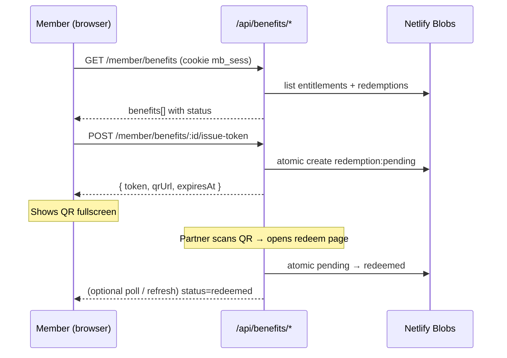
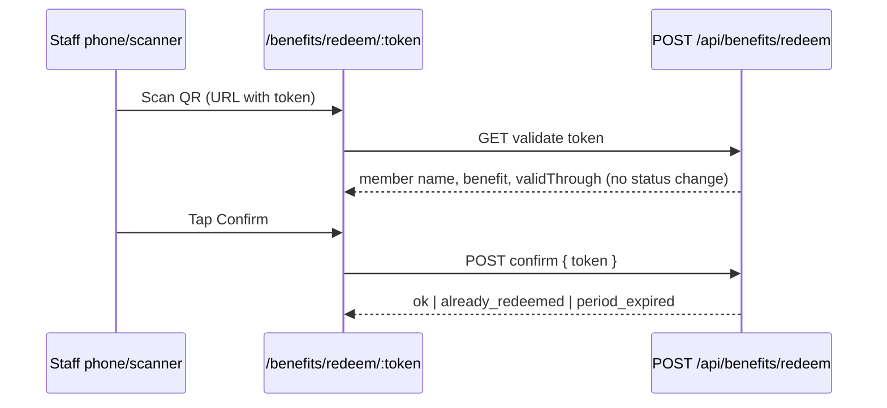

# Partner Benefits — Barcode / QR Redemption Plan

> **Status: IMPLEMENTED (MVP)** — Partner Benefits QR redemption + `/admin/coupons`.

---

## TL;DR

- **QR אישי לכל מנויה לכל הטבה** — לא QR כללי + הזנת שם.
- **מיקום ב-UI:** סקשן **Benefits** ב-[Member area](https://www.amarewellness.com/member), אחרי Bring a Friend.
- **זרימה:** Use benefit → QR (תקף עד Confirm **או** סוף החודש) → סריקה → **Confirm** בלבד סוגר את ההטבה.
- **אחסון:** Netlify Blobs + Functions — **לא** Mindbody.
- **MVP:** monthly members, QR + redeem, **`/admin/coupons`** (יצירת הטבות + analytics + CSV).

---

## החלטות נעולות (2026-06-24)

| נושא | החלטה |
|------|--------|
| **אימות שותף** | **ללא Partner PIN** — סריקה → Confirm בלבד. נוחות לבית הקפה עדיפה על hardening. |
| **Self-redeem** | מקובל: מנויה theoretically יכולה לאשר לעצמה מהטלפון השני. ל-free drink זה סיכון עסקי נמוך. |
| **Timezone** | **`America/New_York`** (Florida) — קבוע לכל הסטודיו. `periodKey` = `YYYY-MM` לפי שעון FL. |
| **QR vs barcode** | **QR בלבד** ב-product (עובד עם כל מצלמת טלפון). |
| **תוקף QR** | **עד Confirm או סוף החודש** (FL) — **לא** TTL של 15 דקות. צילום מסך OK. |
| **סריקה vs Confirm** | **סריקה לא מבזבזת** — רק לחיצת **Confirm** סוגרת את ההטבה. |
| **Admin** | **`/admin/coupons`** — יצירה/עריכה של הטבות + analytics (שמות לקוחות) — **ב-MVP**. |
| **Catalog** | Netlify Blobs (נערך מאדמין) — **לא** JSON קשיח ב-repo ל-MVP. |

---

## 1. השוואת גישות — למה ברקוד אישי?

| קריטריון | ברקוד **אישי** (מומלץ) | ברקוד **כללי** + שם / טלפון |
|----------|------------------------|------------------------------|
| **UX בבית הקפה** | סריקה → אישור (2–3 שניות) | סריקה → חיפוש שם → אישור (15–30+ שניות, טעויות כתיב) |
| **מניעת כפילויות** | טוקן חד-פעמי / מוגבל — לא ניתן לנצל פעמיים | קשה: אותו ברקוד + שם שונה, או אותה לקוחה פעמיים |
| **דיווח** | `memberClientId` + `benefitId` + timestamp אוטומטי | תלוי בדיוק ההקלדה |
| **פרטיות** | השם מוצג רק **אחרי** סריקה (לשותף מאומת) | השם נאמר בקול / מוקלד בקופה |
| **התקנה אצל השותף** | QR סטטי על דלפק **לא** — ה-QR הוא של **הלקוחה**, לא של העסק | QR אחד על הקיר — פשוט יותר פיזית, גרוע יותר בתפעול |
| **סיכון זיוף** | טוקן אישי + 1×/חודש; סריקה לבד לא סוגרת | שיתוף screenshot — סיכון מקובל |

**מסקנה:** QR כללי מתאים רק לקמפיין ציבורי — **לא** להטבה בלעדית למנויות Amaré.

### 1.1 תוקף QR — עד Confirm או סוף החודש (נעול)

**לא** TTL קצר (15 דק'). ה-QR נשאר **pending** עד:

1. **Confirm** — הקפה לוחצת אישור → `redeemed`, לא זמין שוב החודש.
2. **סוף החודש** — 23:59:59 `America/New_York` ביום האחרון → פג אם לא נוצל.

**סריקה ≠ מימוש.** אם מישהו סורק מתוך סקרנות (validate / פותח את העמוד) **בלי** Confirm — ההטבה **עדיין זמינה**. רק Confirm משנה סטטוס.

```text
יוני 5  →  Use benefit → screenshot
יוני 10 →  חברה סורקת מתוך סקרנות → רואה "Sarah M." → סוגרת בלי Confirm
          →  ההטבה עדיין pending ✓
יוני 20 →  מנויה מציגה screenshot בקפה → Confirm ✓ → redeemed
```

**UX למנויה:** פעם אחת בחודש — Use benefit, צילום מסך, לא חייבת לחזור לאתר. כפתור **Open my QR** אם pending קיים (אותו token).

### 1.2 וарианты אחרים (לא MVP)

| וариант | מתי שווה |
|---------|----------|
| **Deep link + PIN קצר** (6 ספרות) | גיבוי אם סורק QR לא עובד — המנויה מקריאה PIN, השותף מקליד |
| **QR "מתחדש"** (rotating) | אם בעתיד נרצה hardening — לא ל-MVP |
| **OTP SMS** | overkill; רק להטבות יקרות |

~~TTL 15 דק~~ — **הוחלף:** תוקף = עד Confirm או `periodEnd` (סוף חודש FL).

---

## 2. Product decisions (להחלטה)

### 2.1 מי זכאית להטבות?

| אפשרות | יתרון | חיסרון |
|--------|--------|--------|
| **A — Monthly membership פעילה** (Monthly 5/8/Unlimited) | עקבי עם "Member benefits" ב-pricing | Pack holders לא מקבלים |
| **B — כל לקוחה עם ≥1 ביקור / pack פעיל** | רחב יותר | עלות גבוהה יותר לשותפים |
| **C — רשימה ידנית / tier לפי SKU** | גמיש | יותר תחזוקה |

**הצעה ל-MVP:** **A** — monthly membership פעילה (reuse לוגיקת eligibility דומה ל-[Bring-a-Friend](bring-a-friend-guest-pass-plan.md) / `stripe-subscription-store`). Pack-only clients רואים הודעה: "Partner perks are included with monthly memberships."

### 2.2 תדירות שימוש

| הטבה | הצעה |
|------|------|
| משקה חינם בבית קפה | **1× לחודש קלנדרי** למנויה (מפתח `YYYY-MM`) |
| הטבות עתידיות | configurable per benefit: `once`, `monthly`, `unlimited`, `once_per_pack` |

**Timezone (נעול):** `periodKey` = `YYYY-MM` ו-`expiresAt` = **חצות סוף החודש** ב-**`America/New_York`**. תאריכי UI: "Valid through Jun 30" / "Available again Jul 1".

### 2.3 מה קורה אחרי redemption?

- סטטוס ההטבה למנויה: **Redeemed** + תאריך + שם השותף.
- עד סוף החודש: "You've used this month's coffee perk" + תאריך חידוש (1 בחודש הבא).
- **לא** מבטלים אוטומטית ב-Mindbody — זו הטבה חיצונית.

### 2.4 מה השותף רואה?

עמוד mobile-first — **ללא login, ללא PIN** (החלטה נעולה):

```
┌─────────────────────────────┐
│  AMARÉ × [Coffee Shop Logo] │
│                             │
│  Free drink — member perk   │
│                             │
│  Member: Sarah M.           │
│  Valid through: Jun 30      │
│                             │
│  [ ✓ Confirm redemption ]   │
│                             │
│  (Viewing only — not used   │
│   until you tap Confirm)    │
└─────────────────────────────┘
```

- **Validate (סריקה)** — מציג פרטים; **לא** משנה סטטוס. אפשר לסרוק שוב ושוב.
- **Confirm** — רק אם `pending` ולפני `expiresAt` (סוף חודש). מעביר ל-`redeemed`.
- אחרי Confirm: "Redeemed ✓" + timestamp (לא ניתן לאשר שוב).

---

## 3. User flows

### 3.1 מנויה (Member area)



**UI (סקשן Benefits):**

- כרטיס לכל הטבה פעילה: לogo שותף, כותרת, תיאור, תנאים, סטטוס.
- כפתור **Use benefit** (או **Open my QR** אם כבר pending) → modal עם QR.
- הוראות: "Show this screen to the barista — or save a screenshot for later this month."
- **אין countdown** — במקום: "Valid through Jun 30".
- אם כבר נוצלה החודש: "Redeemed Jun 12 · Available again Jul 1".

### 3.2 שותף (בית קפה)



**דרישות UX לשותף:**

- עמוד נטען ב-<2 שניות על 4G.
- כפתור Confirm גדול (thumb zone) — **אין PIN, אין הרשמה**.
- **אין** צורך באפליקציה — URL רגיל.
- onboarding: "סרקו את המסך של הלקוחה → Confirm" — זה הכל.

### 3.3 Amaré Admin — `/admin/coupons` (MVP)

כרטיס חדש ב-[Admin hub](https://www.amarewellness.com/admin/) — אותו pattern כמו [Follow-Up Dashboard](../src/content/admin-follow-ups.html): `ADMIN_DEBUG_TOKEN` ב-`x-admin-token`, UI ב-`components-admin-sms.css`.

```text
/admin                    → כרטיס "Partner Benefits / Coupons"
/admin/coupons            → ניהול הטבות + analytics
```

#### 3.3.1 יצירה / עריכת הטבה (Coupons)

טופס (create + edit + activate/deactivate):

| שדה | דוגמה | היכן מוצג |
|-----|--------|-----------|
| **Benefit title** | `Free drink` | Member area, דף סריקה, analytics |
| **Partner name** | `Café Example` | Member area, דף סריקה |
| **Partner slug** | `hallandale-cafe-x` | internal key, דוחות |
| **Description** | `One hot or iced drink` | כרטיס ב-Member area |
| **Terms** | `Monthly members, 1×/month` | כרטיס + redeem page |
| **Logo URL** | `/images/partners/cafe-x.svg` | optional — Member + redeem |
| **Active from / until** | `2026-06-01` … `2026-12-31` | visibility |
| **Eligibility** | `monthly_membership` (MVP) | server-side gate |
| **Frequency** | `1× calendar month` | server-side gate |

שמירה → Blob `benefit:{benefitId}`. **אין deploy** להוספת קפה חדש.

#### 3.3.2 Analytics — redemptions

טבלה + סיכומים (חודש נבחר, default = חודש נוכחי FL):

| Redeemed (FL) | Member | Benefit | Partner | Status |
|---------------|--------|---------|---------|--------|
| Jun 24, 11:42 AM | Sarah M. | Free drink | Café Example | redeemed |
| Jun 23, 9:15 AM | Jane K. | Free drink | Café Example | redeemed |

**Summary cards:**

- Total redemptions this month
- Redemptions by benefit
- Redemptions by partner
- Pending (issued QR, not yet confirmed) — count only

**Actions:** Export CSV · Refresh · Filter by benefit / partner

מקור נתונים: index keys `report:{periodKey}:{partnerSlug}:{redemptionId}` (נוצר ב-confirm time — לא scan של כל ה-store).

#### 3.3.3 Admin APIs

| Method | Path | Auth | תיאור |
|--------|------|------|--------|
| `GET` | `/api/admin/benefits/list` | `x-admin-token` | כל ההטבות (catalog) |
| `POST` | `/api/admin/benefits/create` | `x-admin-token` | benefit חדש |
| `PUT` | `/api/admin/benefits/:id` | `x-admin-token` | עריכה / activate / deactivate |
| `GET` | `/api/admin/benefits/redemptions` | `x-admin-token` | `?month=2026-06&benefitId=&partnerSlug=` |
| `GET` | `/api/admin/benefits/redemptions/export` | `x-admin-token` | CSV download |

Reuse [`new-client-sms-admin-auth.mjs`](../netlify/functions/new-client-sms-admin-auth.mjs) — **אותו** `ADMIN_DEBUG_TOKEN` כמו שאר כלי האדמין.

**לא ב-MVP (admin):** void redemption, partner portal, bulk import.
---

## 4. ארכיטקטורה טכנית

### 4.1 התאמה ל-stack קיים

| רכיב | קיים | שימוש חדש |
|------|------|-----------|
| Auth מנויה | `mb_sess` + `mindbody-consumer-lib` | זיהוי `memberClientId` |
| Eligibility | `stripe-subscription-store` | monthly active check |
| Atomic state | `blobs-conditional-create.mjs` | pending → redeemed |
| Blobs | `guest-pass-blobs.mjs` pattern | store חדש `partner-benefits` |
| Member UI | `mindbody-member.html` + `member-dashboard.js` | סקשן Benefits + modal QR |
| QR generation | `scripts/generate-pricing-qr.mjs` | reuse styling ל-QR דינמי ב-client |
| Admin UI | [`admin-index.html`](../src/content/admin-index.html) + Follow-Up pattern | כרטיס + `/admin/coupons` |
| Admin auth | `new-client-sms-admin-auth.mjs` | `ADMIN_DEBUG_TOKEN` |

| Mobile app | `amare-app` ProfileScreen | Phase 2 — אותו API |

### 4.2 מודל נתונים (Netlify Blobs)

Store: `partner-benefits`

**Benefit catalog** — **נוצר/נערך ב-`/admin/coupons`**, נשמר ב-Blob:

```json
{
  "id": "coffee_free_drink_2026",
  "partnerSlug": "hallandale-cafe-x",
  "partnerDisplayName": "Café Example",
  "title": "Free drink",
  "description": "Any hot or iced drink (excluding alcohol).",
  "terms": "One per member per calendar month. Show QR at checkout.",
  "logoUrl": "/images/partners/cafe-x.svg",
  "activeFrom": "2026-06-01",
  "activeUntil": "2026-12-31",
  "eligibility": { "type": "monthly_membership" },
  "frequency": { "type": "calendar_month", "limit": 1 },
  "active": true,
  "createdAt": "2026-06-01T10:00:00-04:00",
  "updatedAt": "2026-06-01T10:00:00-04:00"
}
```

```text
Key: benefit:{benefitId}
```

Seed אופציונלי: benefit ראשון (קפה) ב-deploy script — **לא** חובה; אפשר ליצור רק מאדמין.

`expiresAt` על redemption record = **סוף `periodKey`** (חישוב server-side), לא `tokenTtlSeconds`.

**Redemption record** (key atomi):

```
Key: redemption:{benefitId}:{memberClientId}:{periodKey}:{nonce}
     periodKey = 2026-06 (calendar month) OR benefit-lifetime

Value:
{
  "status": "pending" | "redeemed" | "expired" | "cancelled",
  "memberClientId": 12345,
  "memberFirstName": "Sarah",
  "memberLastInitial": "M",
  "benefitId": "coffee_free_drink_2026",
  "periodKey": "2026-06",
  "issuedAt": "ISO",
  "expiresAt": "2026-06-30T23:59:59-04:00",
  "redeemedAt": null,
  "redeemedIp": null,
  "partnerSlug": "hallandale-cafe-x"
}
```

**Lookup index** (secondary key for scan):

```
Key: token:{tokenHash}
Value: { redemptionKey, ...minimal fields for validate }
```

`tokenHash = HMAC-SHA256(token, BENEFITS_TOKEN_SECRET)` — לא שומרים token גolמי ב-Blobs.

**Report index** (ל-analytics ב-admin — נוצר ב-confirm):

```text
Key: report:{periodKey}:{partnerSlug}:{redemptionId}
Value: { redeemedAt, memberClientId, memberDisplayName, benefitId, benefitTitle, partnerDisplayName, status }
```

### 4.3 API endpoints

#### Member + public redeem

| Method | Path | Auth | תיאור |
|--------|------|------|--------|
| `GET` | `/api/benefits/member/list` | `mb_sess` | הטבות פעילות + סטטוס |
| `POST` | `/api/benefits/member/issue-token` | `mb_sess` | body: `{ benefitId }` → QR |
| `GET` | `/api/benefits/redeem/validate?token=` | public | read-only — פרטים לדף סריקה |
| `POST` | `/api/benefits/redeem/confirm` | public | pending → redeemed + report index |

#### Admin (`/admin/coupons`)

| Method | Path | Auth | תיאור |
|--------|------|------|--------|
| `GET` | `/api/admin/benefits/list` | `x-admin-token` | catalog |
| `POST` | `/api/admin/benefits/create` | `x-admin-token` | benefit חדש |
| `PUT` | `/api/admin/benefits/:id` | `x-admin-token` | עריכה / active flag |
| `GET` | `/api/admin/benefits/redemptions` | `x-admin-token` | analytics JSON |
| `GET` | `/api/admin/benefits/redemptions/export` | `x-admin-token` | CSV |

**Public redeem page:** `/benefits/redeem?t=<token>`

**Admin page:** `/admin/coupons` (+ כרטיס ב-`/admin`)

### 4.4 QR payload

URL מומלץ (עובד עם כל סורק QR):

```
https://www.amarewellness.com/benefits/redeem?t=<token>
```

- **לא** לשים PII ב-query מלבד opaque token.
- אורך token: ≥128 bit entropy (base64url ~22 chars min).

Client-side QR: ספרייה קלה (כבר יש `qr-code-styling` ב-devDependencies) — render ב-modal.

### 4.5 אבטחה (MVP — convenience first)

| איום | mitigation | הערה |
|------|------------|------|
| Confirm כפול | atomic pending → redeemed | רק Confirm ראשון מצליח |
| צילום מסך + שימוש מאוחר | תקף עד סוף חודש; Confirm **פעם אחת** | UX מכוון — screenshot OK |
| שיתוף screenshot לחברה | מי ש-Confirm ראשון "שורף" | self-limiting |
| self-redeem | **לא חוסמים ב-MVP** | מקובל |
| brute-force token | rate limit + token entropy | baseline |
| redeem ללא membership | issue-token בודק eligibility | server-side |
| שותף מאשר בטעות | "Confirm only after providing the drink" | void ב-Phase 2 |
| Partner PIN | **לא ב-MVP** | נוחות בקופה |

**מה מגן:** QR אישי + **Confirm חד-פעמי לחודש** + `expiresAt` = סוף חודש FL.

### 4.6 Concurrency (race)

שתי לחיצות **Use benefit** במקביל:

- אם pending קיים לחודש → החזר **אותו** token + QR (idempotent).
- אם כבר `redeemed` לחודש → `409 already_redeemed_this_period`.
- אם `periodKey` עבר ולא redeemed → `expired` (חודש חדש = issue חדש).

---

## 5. UI / UX — Member area

### 5.1 מיקום ב-HTML

הוספה ל-[`src/content/mindbody-member.html`](../src/content/mindbody-member.html) אחרי Bring a Friend:

```html
<section class="mb-member-card mb-member-card--benefits" aria-labelledby="mb-benefits-title">
  <h2 id="mb-benefits-title" class="mb-member-card__title">Benefits</h2>
  <p class="mb-member__hint">Exclusive perks from local partners — for active monthly members.</p>
  <div data-mb-benefits-list></div>
</section>
```

### 5.2 מצבי כרטיס הטבה

| מצב | UI |
|-----|-----|
| `eligible` | כפתור **Use benefit** |
| `pending_token` | **Open my QR** — אותו QR עד Confirm / סוף חודש |
| `redeemed` | ✓ Redeemed Jun 12 · Next: Jul 1 |
| `not_eligible` | הסבר (upgrade / monthly only) |
| `expired_campaign` | hidden או "Offer ended" |

### 5.3 Modal QR

- רקע כהה, QR גדול (min 280px).
- טקסט: "Valid through Jun 30" (לא countdown).
- benefit title + partner name.
- כפתור **Close** — QR נשאר pending (צילום מסך נשאר תקף).

### 5.4 Admin — `/admin/coupons`

Layout (reuse `admin-sms` / `admin-dashboard` classes):

```text
← Admin home

Partner Benefits / Coupons
Create perks, view redemptions, export CSV.

[ Admin token unlock — same as Follow-Up Dashboard ]

── Benefits (catalog) ──────────────────────
[ + New benefit ]

| Title       | Partner      | Active   | Redemptions (month) | Actions   |
| Free drink  | Café Example | ✓ Active | 47                  | Edit · Off |

── Redemptions (Jun 2026) ──────────────────
[ Month ▼ ] [ Benefit ▼ ] [ Partner ▼ ] [ Export CSV ]

Summary: 47 redeemed · 12 pending QR issued

| Redeemed      | Member    | Benefit     | Partner      |
| Jun 24 11:42  | Sarah M.  | Free drink  | Café Example |
```

**Edit benefit modal:** title, partner name, slug, description, terms, logo URL, dates, eligibility, frequency, active toggle.

**Hub card** (`admin-index.html`):

```html
<a class="admin-hub__card" href="/admin/coupons">
  <h2 class="admin-hub__card-title">Partner Benefits / Coupons</h2>
  <p class="admin-hub__card-desc">
    Create member perks, track redemptions by client name, export CSV.
  </p>
  <span class="admin-hub__card-path">/admin/coupons</span>
</a>
```

---

## 6. תקשורת ושיווק

| ערוץ | תוכן |
|------|------|
| Email ל-monthly members | "New perk: free coffee at [Partner]" + CTA ל-`/member` |
| Instagram / in-studio | פoster עם "Members: claim in your account" — **לא** QR כללי |
| Onboarding front desk | "Your coffee perk is in the Member area on your phone" |
| Partner materials | brief 1-pager: scan → confirm; screenshot of redeem page |

Phase 2: push notification ב-`amare-app` כשהטבה חדשה עולה.

---

## 7. תפעול שותף (בית קפה)

### 7.1 onboarding שותף (~15 דקות)

1. שליחת link לדemo: `/benefits/redeem?t=DEMO` (token שמציג mock, לא redeem אמיתי).
2. הדפסת כרטיס לדלפק: "Amaré members — scan their phone screen."
3. איש קשר לשאלות (מס' WhatsApp של הסטודיו).

### 7.2 reconciliation

- דוח חודשי מ-**`/admin/coupons`** → Export CSV (שמות לקוחות, תאריכים, שותף).
- Phase 2: partner portal read-only (שותף רואה רק את שלו).

---

## 8. MVP scope vs phases

### Phase 1 — MVP

- [ ] **`/admin/coupons`** — create/edit benefits + analytics table + CSV export.
- [ ] כרטיס חדש ב-`/admin` hub.
- [ ] Benefit catalog ב-Netlify Blobs (editable מאדמין).
- [ ] Eligibility: monthly membership active (`stripe-subscription-store`).
- [ ] Frequency: 1× calendar month (FL).
- [ ] Member area: Benefits section + QR modal.
- [ ] Public redeem page (`title`, `partner`, `member name` on scan).
- [ ] Netlify Blobs + atomic confirm + report index.
- [ ] Rate limiting בסיסי.

**לא ב-MVP:** amare-app, void/undo, partner portal, multiple eligibility tiers, email on redeem, Partner PIN.

### Phase 2

- [ ] Multiple partners — כבר נתמך ב-admin; רק UI polish + logos.
- [ ] amare-app Benefits tab (reuse API).
- [ ] Email / SMS when benefit redeemed.
- [ ] Numeric fallback if QR scan fails.
- [ ] Void redemption (admin).
- [ ] Partner PIN (רק אם abuse).

### Phase 3

- [ ] Geo-fencing (redeem only within X km — probably overkill).
- [ ] Tiered benefits (Unlimited gets 2× month).
- [ ] API webhook לשותף POS (אם יש מערכת).
- [ ] Member-submitted receipt photo fallback.

---

## 9. הערכת מאמץ (גסה)

| משימה | ימים (dev) |
|-------|------------|
| Blobs schema + member/redeem APIs | 2–3 |
| Member UI (list + QR modal) | 1–2 |
| Public redeem page | 1 |
| **`/admin/coupons` UI + admin APIs** | **2–3** |
| Eligibility integration | 0.5–1 |
| QA + edge cases | 1 |
| **סה"כ MVP** | **~8–11 ימי dev** |

---

## 10. שאלות פתוחות (להחלטה לפני impl)

1. **שם השותף הראשון** — מי בית הקפה, מה בדיוק כלול (size, exclusions)? *(נוצר ב-admin)*
2. **Pack holders** — upsell card בלבד, או hidden?
3. **שפה** — redeem page באנגלית בלבד (Hallandale) או EN+ES?
4. **Branding** — co-logo Amaré × partner על מסך ה-QR?
5. **Void** — האם צריך "ביטול redemption" תוך X דקות (טעות ברista)?
6. **App** — האם חובה ב-MVP או מספיק mobile web ב-`/member`?

---

## 11. סיכום

**QR אישי + confirm ציבורי** — הזרימה הסופית:

```text
Member: Use benefit once/month → QR (screenshot OK)
        Valid until Confirm OR end of month (FL)

Cafe:   Scan → view only (benefit still available)
        Confirm → redeemed (once per month)

No PIN, no login, no name entry
```

1. **חוויית מנויה** — screenshot, בלי לחזור לאתר.
2. **חוויית שותף** — scan + tap; סריקה לבד לא סוגרת.
3. **שליטה** — Confirm = 1× לחודש; analytics ב-`/admin/coupons`.
4. **stack** — Blobs + atomic + admin hub קיים.

---

## 12. קבצים צפויים (implementation checklist)

| קובץ | תפקיד |
|------|--------|
| `docs/MEMBER-PARTNER-BENEFITS-PLAN.md` | מסמך זה |
| `netlify/functions/benefits-member-list.mjs` | member list |
| `netlify/functions/benefits-issue-token.mjs` | issue QR |
| `netlify/functions/benefits-redeem-validate.mjs` | validate (scan page data) |
| `netlify/functions/benefits-redeem-confirm.mjs` | confirm + report index |
| `netlify/functions/benefits-admin-*.mjs` | catalog CRUD + redemptions analytics |
| `netlify/functions/partner-benefits-blobs.mjs` | store helpers |
| `src/content/benefits-redeem.html` | public scan/confirm page |
| `src/content/admin-coupons.html` | admin UI |
| `src/content/admin-index.html` | hub card |
| `src/js/admin-coupons.js` | admin UI logic |
| `src/js/member-benefits.js` | member UI + QR |
| `src/js/benefits-redeem.js` | partner scan/confirm UI |
| `src/css/components-member-benefits.css` | member + redeem styling |
| `src/content/mindbody-member.html` | Benefits section |
| `public/_redirects` | `/benefits/redeem`, `/admin/coupons` |

---

*נוצר: 2026-06-24 · Amaré Wellness Studio*
