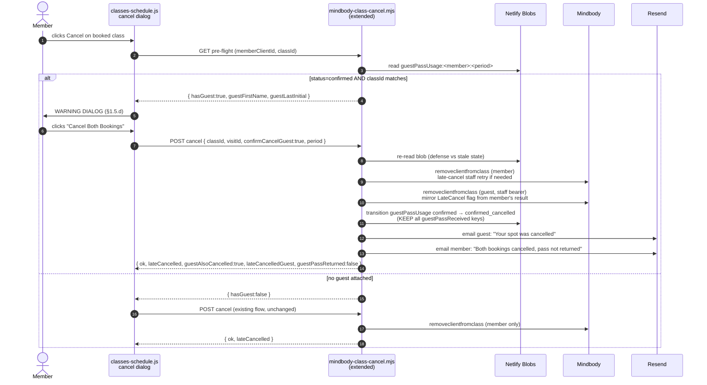
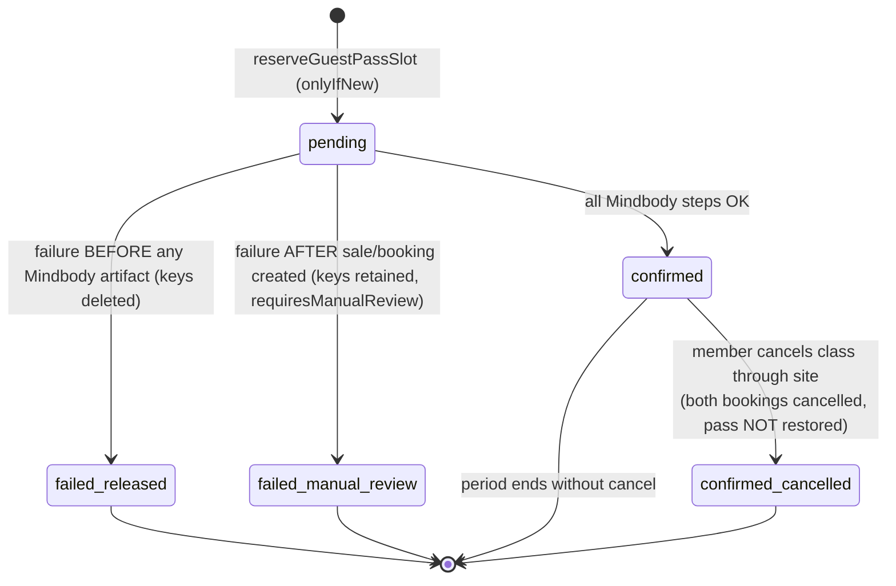
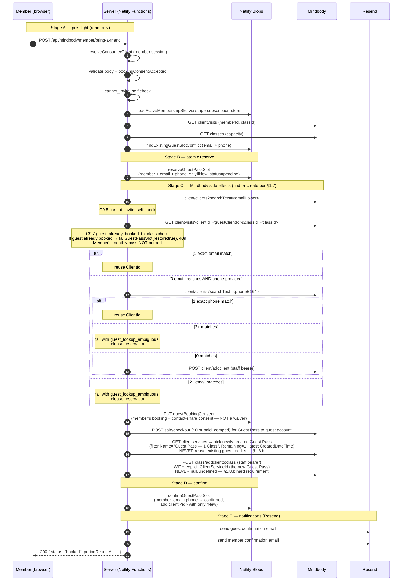
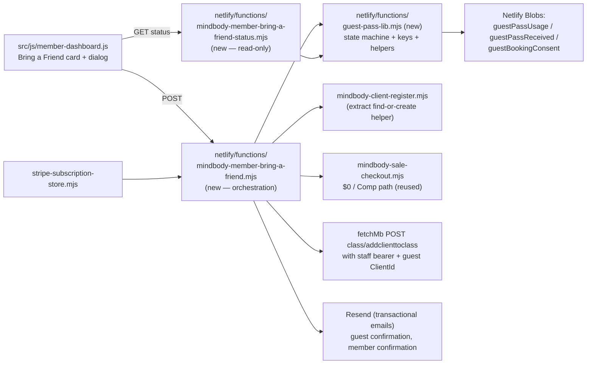

# Bring-a-Friend Guest Pass — Implementation Plan

> **Status: PAUSED** — waiting on Resend domain verification (blocked on Wix → GoDaddy domain transfer).
> See [Current status & blockers](#current-status--blockers) at the bottom.

This document captures the full product + technical plan for the **Bring-a-Friend Guest Pass** feature so we can resume implementation cleanly once the email layer is unblocked. The plan was validated end-to-end across two design rounds; nothing here is speculative.

---

## TL;DR

- Any active **monthly membership** member (Monthly 5, Monthly 8, or Monthly Unlimited) can bring **one complimentary guest per calendar month**.
- The guest is registered as a **real Amaré Mindbody Client** with their own `ClientId` — **not** as a bonus credit on the member's account.
- The guest is booked into a class **only if the member is already booked into the same class**.
- Eligibility is tracked **on our side** (Netlify Blobs), not in Mindbody — using a `reserve-first` state machine that closes concurrency races before any Mindbody artifact is created.
- A new server-only endpoint `/api/mindbody/member/bring-a-friend` orchestrates the full flow.
- **Waivers are completed in-studio at the front desk before class.** We don't run an online waiver flow; the member confirms only that the guest gave permission to be booked (see §1.6).
- **Cancelling a class with an attached guest cancels BOTH bookings**, and the monthly pass is **not** restored — late OR early cancel. The Netlify Blobs cap is the source of truth, not Mindbody's credit state (see §1.5). The UI shows a blocking warning dialog before cancelling.
- Transactional emails to the guest (booking confirmation + arrival instructions for the in-studio waiver, plus cancellation notifications) are sent through **Resend**, which is the current blocker.

---

## 1. Product decisions (locked)

### 1.1 Why the guest is a real Mindbody client, not a credit on the member

Mindbody's Public API booking endpoint `class/addclienttoclass` accepts a **single** `ClientId` + `ClientServiceId`, and the credit must belong to the booking client. Three options were considered:

- **Pattern A** — Comp the Guest Pass to the guest's own Amaré Mindbody client record. Guest appears on the class roster and completes the waiver at the front desk on arrival (per §1.6 — no online waiver flow exists).
- **Pattern B** — Add an extra "Guest" credit to the member's `ClientServices`. Technically simple, but the credit can only deduct when the **member** is being booked. Net effect: member gets a free bonus class for themselves. Not actually "bring a friend".
- **Pattern C** — Shareable invite link that the guest redeems independently.

**Pattern A is the only option that satisfies the product intent**:
- Insurance / liability — the guest can be tracked, contacted, and required to sign the in-studio waiver before class because they exist as their own Amaré client.
- Instructor headcount and class roster reflect reality.
- Reporting (Mindbody comp sales) is auditable.
- The benefit is genuinely "bring a friend", not "get a free class".

Pattern C is a candidate for Phase 3 as a viral-marketing UI on top of the same backend.

### 1.2 Per-membership allocation

**All three monthly memberships get the perk from MVP day one**, with identical allocation:

| SKU | Display name | Guest pass allocation |
|-----|--------------|----------------------|
| `monthly_5` | Monthly 5 Classes | 1 per calendar month |
| `monthly_8` | Monthly 8 Classes | 1 per calendar month |
| `monthly_unlimited` | Monthly Unlimited | 1 per calendar month |

Non-monthly products (drop-ins, class packs, New Client Special) are **not** eligible — `403 tier_not_eligible` is returned. The check runs against `localSku === <one of the three>` resolved from `stripe-subscription-store.listActiveByMindbodyClientId()`.

**Note on value differentiation:** the original design proposed a tiered rollout (Unlimited first, 8 in Phase 2, 5 paid only) to push members toward the higher tier. This was deliberately overridden in favor of a flat allocation — the perk is now a feature of "being a monthly member at all" rather than a differentiator between tiers. If down the road we want to tighten this (e.g. give Unlimited 2/month or open it to a wider class roster), it's a single-config change in `eligibleMemberSkus` + `allocationPerPeriod`.

### 1.3 Eligibility lives on our side, not in Mindbody

We deliberately **do not** auto-add a Guest Pass credit to every renewal because:

- Unused credits accumulate and confuse members ("I have 3 guest passes I never used").
- Cancellations, refunds, and tier changes become a tangled state.
- Mindbody has no awareness that the credit is a perk vs a purchase.

Instead the eligibility lives in Netlify Blobs (`@netlify/blobs`) using the existing
[`netlify/functions/blobs-conditional-create.mjs`](../netlify/functions/blobs-conditional-create.mjs)
atomic-create helper (which already fixes the upstream SDK `setJSON` bug). The Guest Pass service is **only** sold to the guest at the moment the member uses the benefit.

### 1.4 Member-must-be-in-class + cannot-invite-self

A guest pass can only be used for a class the **member** is already booked into, **and** the guest must be a different person from the member.

**Member-must-be-in-class:**

- Keeps the perk consistent with the "bring a friend" framing.
- Prevents members from gifting free classes to strangers without attending.
- Enforced in Stage A by checking `clientvisits` for the member + `classId` before reserving. Failure → `409 member_not_booked_to_class`.

**Cannot-invite-self** (two-layer enforcement to cover all attack vectors):

| Layer | Where | Check | Error |
|-------|-------|-------|-------|
| 1 | Stage A pre-flight (cheap, no side effects) | `normalizeEmail(guestEmail) === normalizeEmail(memberSession.email)` | `400 cannot_invite_self` (no KV write, no Mindbody) |
| 2 | Stage C9.5, immediately after `findOrCreateGuestClient` resolves | `guestClientId === memberClientId` (definitive — by resolved ClientId) | `failGuestPassSlot({ restore: true })` + `400 cannot_invite_self` |

Layer 1 catches the obvious case (same email typed). Layer 2 is the **source of truth** and catches edge cases that Layer 1 misses:
- Member has multiple email addresses on file (one in session, one old one in Mindbody) — guest email is the old one → resolves to member's own ClientId.
- Member supplied their own phone but a different email — the phone-fallback branch of §1.7 resolves to member's own ClientId.
- Member has duplicate Mindbody records (rare but real).

Without Layer 2, a self-invite attempt would consume the monthly pass slot, sell an extra (unwanted) Guest Pass credit into the member's own wallet, then fail at `addclienttoclass` with "client already booked" — leaving the member with `failed_manual_review`, a phantom $0/comp sale, and burned monthly eligibility. Layer 2 catches this immediately after `findOrCreateGuestClient` returns and **before** any sale is attempted, so `restore: true` cleanly deletes the reservation and no Mindbody mutation happens.

### 1.5 Cancellation behavior (MVP) — member cancels a class with an attached guest

**Locked decision:** When a member cancels a class for which a Bring-a-Friend pass was already used, the cancellation must **also cancel the guest's booking**. This applies to **both early-cancel (in-window) and late-cancel** scenarios. The monthly benefit stays consumed.

#### 1.5.a What's wrong with doing nothing

Mindbody treats the member's booking and the guest's booking as two independent visit records under two separate `ClientId`s. The existing [`netlify/functions/mindbody-class-cancel.mjs`](../netlify/functions/mindbody-class-cancel.mjs) only calls `removeclientfromclass` for `ctx.clientId` (the member). If we ship Bring-a-Friend without an integration into this flow, members can cancel themselves while the guest stays booked — defeating the spirit of "bring a friend WITH you to class", and leaving the front desk with a guest showing up alone for a class their inviter never attended.

#### 1.5.b Required cancel flow

The existing cancel endpoint must be extended (no new endpoint) to:

1. Member clicks Cancel on a booked class in the dashboard or schedule UI.
2. **Pre-flight read (no Mindbody calls yet):** read `guestPassUsage:<memberClientId>:<period>` blob.
3. **Branching on the blob:**
   - **No blob, or blob status is not `confirmed`, or `classId` does not match** → behave exactly like the current flow. No warning, no extra calls. The Bring-a-Friend record is untouched.
   - **Blob status is `confirmed` AND `classId` matches** → return to the UI a flag indicating an attached guest exists, with `guestFirstName` and the last initial of `guestLastName` (e.g. `"Sarah C."`). **No cancellation has been issued yet at this point.**
4. **UI shows a blocking warning dialog** (see §1.5.d for exact copy and button labels). User picks one of two outcomes:
   - **Keep Booking** → no API call, dialog closes, both bookings remain intact.
   - **Cancel Both Bookings** → UI sends a single `POST cancel` request with `confirmCancelGuest: true` and the `period` it read from the pre-flight.
5. **Server-side cancel sequence** (only on the `confirmCancelGuest: true` request):
   - 5a. Re-read the `guestPassUsage` blob to confirm status is still `confirmed` and `classId` still matches (defense against a stale UI; if it changed, return `409 guest_pass_state_changed` and the UI re-checks).
   - 5b. Cancel the **member's** booking via the existing `removeclientfromclass` path (consumer token first, late-cancel staff-bearer retry as today).
   - 5c. Cancel the **guest's** booking via `removeclientfromclass` with the **staff bearer**, using `ClientId = guestClientId`, `VisitId = guestVisitId`, and **mirror the member's late-cancel flag** — if the member's cancel went through the late-cancel retry path, send `LateCancel: true` for the guest too. (Both cancellations are happening at the same instant relative to the class start, so the lateness classification matches.)
   - 5d. Atomically transition the blob: `confirmed → confirmed_cancelled` (see §2 state machine). Persist `cancelledAtIso`, `cancelLateMember`, `cancelLateGuest`, `cancelledByMemberClientId`.
   - 5e. **Do not delete** `guestPassUsage:<memberClientId>:<period>`, `guestPassReceived:email:...`, `guestPassReceived:phone:...`, or `guestPassReceived:client:...`. The monthly cap stays consumed.
   - 5f. Trigger two Resend emails (Phase 1 — blocked on Resend domain verify): guest gets "Your spot in {className} on {date} was cancelled"; member gets a confirmation that both were cancelled.
6. **Response shape additions** (current cancel endpoint response retains all existing fields; new ones are additive):
   - `guestAlsoCancelled: true | false` — `true` only on the path that ran 5c.
   - `guestPassReturned: false` — explicit, so the UI never has to guess.
   - `lateCancelledGuest: true | false | null` — for symmetry with the existing `lateCancelled` field for the member.

#### 1.5.c Pass is NOT restored — neither early nor late

This is the core product rule:

| Cancellation timing | Member's Bring-a-Friend pass for this month | Mindbody-side `Guest Pass — 1 Class` credit |
|---|---|---|
| Late cancel (inside studio window) | **Stays consumed.** Member cannot invite another guest this month. | Mindbody keeps `Remaining: 0` per its late-cancel policy. Irrelevant either way. |
| Early cancel (outside studio window) | **Stays consumed.** Member cannot invite another guest this month. | Mindbody may restore `Remaining: 1`. **We ignore this.** The Netlify Blobs cap is the source of truth. |

> **Critical invariant:** Mindbody credit behavior is **not the source of truth** for whether the member can use another Bring-a-Friend pass this month. Even if Mindbody internally restores the `Guest Pass — 1 Class` credit on early-cancel, the period cap in Netlify Blobs (`guestPassUsage` + `guestPassReceived:email/phone/client`) remains consumed. The endpoint that tries to issue a new pass this month will fail at Stage A pre-flight with `409 already_used_this_month`.

Rationale: the perk's economics assume one comped class per member per calendar month. Letting members game the system by booking + cancelling early + rebooking with a different guest would invalidate the cost model. The next benefit arrives on the 1st of the following month — same rule for everyone.

#### 1.5.d Required UI copy (no paraphrasing)

Warning dialog title:

> *"Cancel your class and your guest?"*

Body (must contain both sentences, in this order):

> *"Canceling this class will also cancel your guest's spot."*
> *"Your Bring a Friend Pass for this month will remain used."*

Buttons (left-to-right, with the destructive action on the right per the existing cancel dialog convention in [`src/js/classes-schedule.js`](../src/js/classes-schedule.js)):

- **Keep Booking** (secondary / cancel button)
- **Cancel Both Bookings** (destructive primary)

Success toast after a confirmed cancellation:

> *"Your class was cancelled and your guest was notified. Your monthly Bring a Friend Pass will not be returned."*

If the late-cancel path was taken for the member (which mirrors to the guest):

> *"Your class and your guest's spot were cancelled inside the studio's late-cancel window. Your monthly Bring a Friend Pass will not be returned."*

#### 1.5.e Sequence diagram for the cancel flow



#### 1.5.f Out-of-band cancellations — explicitly NOT in MVP

These three cases are **known limitations** for MVP. The team accepts them in exchange for shipping faster; Phase 2 closes them via Mindbody webhook/polling sync.

- **Front desk cancels the guest manually in Mindbody Classic.** Our `guestPassUsage` blob stays `confirmed` (we never observed the event). The guest is no longer on the roster, but the pass count for the member remains used for the month — which is the *correct* outcome for MVP per §1.5.c (no restoration). The UI will continue to show the pass as `used` until the period rolls over.
- **Front desk cancels the member manually in Mindbody Classic.** Same as above for the member side; additionally, the guest stays booked. Front-desk SOP must include "if you cancel a member from a class, check whether they have a guest on the same class via the Mindbody roster and cancel the guest manually too." This SOP note must be added to the staff-facing runbook when the feature ships.
- **Studio cancels the entire class.** Both bookings disappear in Mindbody; our blob stays `confirmed`. The "fair" outcome would be to restore the member's pass since the cancellation was the studio's fault, but **automatic restoration on studio-side cancellations is Phase 2** (requires webhook listener or scheduled poll over `classes?lastModified=...`). MVP front-desk SOP: if the studio cancels a class, manually delete the blob keys for any affected members through the Netlify Blobs admin UI (instructions in the staff runbook).

#### 1.5.g Phase 2 — webhook/polling sync for out-of-band events

- Subscribe to (or poll for) Mindbody's class/visit change events.
- On a guest's visit cancellation that we didn't initiate → transition the blob `confirmed → confirmed_cancelled` to reflect reality (and still don't restore the pass).
- On a studio-initiated class cancellation → restore the pass (delete keys) AND transition the blob to a new `restored_studio_cancel` state for auditability.
- On a member's visit cancellation that we didn't initiate → cancel the guest's visit to keep the invariant, then transition to `confirmed_cancelled`.

### 1.6 Waiver (MVP) — booking consent only, in-studio waiver completion

**Important framing:** Amaré does **not** currently have an online waiver flow for new guests. Waivers are completed in-studio at the front desk before class (Mindbody Classic). The Bring-a-Friend MVP must **not** claim that the guest has already signed or agreed to a waiver online.

What the member confirms with the checkbox is **permission to book + sharing of guest's contact info + acknowledgement that the in-studio waiver is mandatory** — it is not a waiver signature.

The full required checkbox text (do not shorten — the privacy-consent piece is what makes it legally usable):

> *"I confirm my guest gave permission to share their contact information with Amaré and understands they must arrive 10 minutes early to complete the in-studio waiver and check-in."*

This consent is persisted in a blob under
`guestBookingConsent:<guestClientId>:<contractVersion>` with `acceptedByMemberClientId`, `acceptedAtIso`, `ip`, `userAgent`, and a copy of the displayed consent text under `consentTextShown` (so we have an immutable record of exactly what wording the member checked off against, in case copy is later updated). Same write pattern as
[`netlify/functions/membership-consent-blobs.mjs`](../netlify/functions/membership-consent-blobs.mjs), but the field stores **booking-and-contact-sharing consent by the member**, not a waiver signed by the guest.

#### Behavior per guest type

When the guest is resolved per §1.7:

- **Existing Amaré client found** (matched by email or phone) → reuse the existing `ClientId`. Don't infer waiver status — the front desk verifies on arrival regardless.
- **No Amaré client exists, new one created** → response includes `requiresInStudioWaiver: true`. The endpoint explicitly signals that this guest definitely has no waiver on file with Amaré.

In both cases the endpoint returns `requiresInStudioWaiver` as a boolean (`true` for newly created, `false` for reused) so the frontend never has to handle undefined.

#### Booking is NOT blocked by waiver status (MVP)

The booking proceeds regardless of waiver state. The front desk remains the single point of waiver verification. This means:

- We do not call any Mindbody waiver-status endpoint in MVP.
- We do not block `addclienttoclass` on waiver state.
- We do not promise the guest is cleared to take class.

#### UI must show (universal, on success response)

> *"Please ask your guest to arrive 10 minutes early to complete their waiver at the front desk."*

When `requiresInStudioWaiver: true`, optionally append a sub-line for emphasis:

> *"This is your guest's first visit to Amaré, so the waiver is required before class."*

Front desk is responsible for final waiver completion. The Resend confirmation email to the guest (§10) will carry the same arrival instruction.

**Phase 2/3** may integrate `clientreleaseofliability` from Mindbody if/when an online waiver flow exists. Until then the "consent" we collect is strictly the member's booking-and-contact-sharing consent — the blob name (`guestBookingConsent`) reflects this honestly.

### 1.7 Guest identity & lookup policy

> **POLICY BLOCK — implementers must read this verbatim before writing any guest-resolution code:**
>
> 1. Guest is created or reused as a client **inside Amaré's Mindbody studio site only**.
> 2. A general Mindbody consumer login for the guest is **not required** in any phase.
> 3. Search by **email first**, then **phone** (only if email returned 0 matches).
> 4. If a clear (1-to-1) match exists → **reuse** the existing Amaré ClientId.
> 5. If no match exists → **create** a new Amaré client with staff bearer.
> 6. If multiple/ambiguous matches exist (2+) → return `guest_lookup_ambiguous` and **do not create a duplicate automatically**.
> 7. **All future guest-side purchases by this person must use the same lookup logic** to attach the purchase to the existing Amaré ClientId.
> 8. **Do not rely on, infer, or trigger automatic merge with a general Mindbody consumer account.** Mindbody does not auto-link studio clients to consumer accounts; treating them as one entity will corrupt this guest's history and any future flows.

The guest is **always** an Amaré Mindbody studio client — never a generic Mindbody consumer-account login. A Mindbody consumer login for the guest is **not required for MVP** (or any phase of this feature). The guest may have one in their own time; we do not depend on it and we do not attempt to merge.

#### Lookup order (deterministic, in this exact sequence)

The same lookup helper must be used by **every** future flow that resolves "guest identity" — Bring-a-Friend, paid guest drop-ins, gifted classes, coupon redemptions, etc. Centralizing this rule prevents accidental duplicate Amaré clients across product surfaces.

1. **Search by email.** `GET /public/v6/client/clients?searchText=<emailLower>`.
   - Filter the results to records where the email **exactly equals** the requested email (case-insensitive). Mindbody's `searchText` is fuzzy; we re-filter on the way out.
   - **Exactly 1 match** → reuse that `ClientId`. Done.
   - **0 matches** → fall through to step 2.
   - **2+ matches with identical email** → return `guest_lookup_ambiguous`. Do **not** auto-create. Do **not** auto-pick the first one. (This case is rare but real — historical data, soft-deleted records, etc.)

2. **Search by phone** (only if step 1 returned 0 matches *and* phone was provided). `GET /public/v6/client/clients?searchText=<phoneE164>` (Mindbody accepts phone-shaped queries).
   - Filter to records whose normalized phone equals the requested normalized phone (`normalizePhone()` defined in `guest-pass-lib.mjs`).
   - **Exactly 1 match** → reuse that `ClientId`. Done. Persist the resolved guest's email back into the request context so subsequent steps use Mindbody's email of record, not the email the member typed.
   - **0 matches** → fall through to step 3 (create).
   - **2+ matches** → return `guest_lookup_ambiguous`. Do **not** auto-create.

3. **Create.** Call the extracted helper version of [`mindbody-client-register.mjs`](../netlify/functions/mindbody-client-register.mjs) via staff bearer with `FirstName`, `LastName`, `Email`, `MobilePhone`. If Mindbody itself rejects with `client_email_already_exists`, that means a race created the record between step 1 and step 3 — re-run step 1, expect exactly 1 match, reuse.

#### Why phone is fallback, not parallel

Email is far more reliable as a unique identifier in Mindbody (the `client_email_already_exists` duplicate guard already enforces it). Phone can legitimately be shared (couples, roommates, family lines), so a phone-only match without an email signal is more dangerous to auto-merge on. By gating phone match on "email returned 0", we only use phone when there is no email evidence at all.

#### What "ambiguous" means in practice

`guest_lookup_ambiguous` is returned as a **409** with payload:

```json
{
  "error": "guest_lookup_ambiguous",
  "message": "We found more than one Amaré client matching this email/phone. Please ask the studio to resolve before booking your guest.",
  "matchedBy": "email" | "phone",
  "candidateCount": 2,
  "candidateClientIds": [100123, 100456]
}
```

The endpoint:
- Does **not** mutate Mindbody.
- Triggers `failGuestPassSlot({ restore: true })` so the member's monthly pass remains available.
- Logs `WARN` with the candidate IDs so the studio can manually merge in Mindbody backoffice. (Phase 2 adds a Resend alert to the studio inbox.)

#### Hard constraints

- **No automatic merge with a general Mindbody consumer account.** Mindbody's Consumer/OAuth identity is a separate concept; the same email can exist as both a studio-scoped Amaré client and a consumer-account login, and Mindbody does not auto-link them. Our find-or-create helper operates exclusively on the **studio site** (site-scoped `API-Key` header → Amaré's site id). Linking to a consumer login, if ever needed, is a separate explicit step.
- **No silent picking.** If `2+` matches are returned at any step, return `guest_lookup_ambiguous`. Never pick "the most recently active" or "the one with most visits" automatically; a wrong pick attaches the perk (and future purchases) to the wrong person.
- **All future guest-side purchases use the same helper.** When Phase 3 or later adds paid guest drop-ins, gift cards, coupon-link redemptions — those flows must call the same `findOrCreateGuestClient()` helper from `guest-pass-lib.mjs`. This is the single source of truth for "which Amaré client is this guest?".

### 1.8 Guest already booked to the same class + Guest with existing services

Two related edge cases that the MVP must handle explicitly, otherwise members will silently burn their monthly pass and/or the guest's existing class credits will be wrongly consumed.

#### 1.8.a Guest already booked to the same `classId`

**After** `findOrCreateGuestClient` resolves a `guestClientId` (Stage C9) **and** the cannot-invite-self Layer 2 check passes (Stage C9.5), but **before** any waiver consent, sale, or booking is attempted, the server must query the **guest's** `clientvisits` for the same `classId`. Scenarios this catches:

- The guest already bought a drop-in / pack and booked themselves into the class.
- A front-desk staff member already added the guest manually.
- A previous Bring-a-Friend attempt already booked them (concurrent / retry).

**Behavior:** If the guest's `clientvisits` shows them booked into this `classId` (with a non-cancelled, non-no-show status):

- Do **not** sell a new Guest Pass.
- Do **not** call `addclienttoclass` again (Mindbody would also reject it, but with a less clear error).
- `failGuestPassSlot({ restore: true })` — the KV reservation is cleaned up. **The member's monthly pass is NOT burned.**
- Return `409 guest_already_booked_to_class` with payload `{ existingVisitId, classId }`. UI copy: *"Your guest is already booked into this class. No pass was used."*

This must happen as Stage C9.7 — sandwiched between cannot-invite-self Layer 2 (C9.5) and waiver-consent write (C10), so that nothing in Mindbody is mutated yet and `restore: true` is a clean rollback.

#### 1.8.b Guest with existing active services / packages — never reuse them

Even when the guest has active credits in their account (drop-ins, class packs, even a membership), the Bring-a-Friend flow must **always**:

1. Sell a **new** `Guest Pass — 1 Class` service to the guest at the configured `unitPriceUsd` (comped to $0 via the `mindbody-sale-checkout` Comp path).
2. Capture the newly created `ClientServiceId` from that sale (filter the post-sale `clientservices` list by `Name === "Guest Pass — 1 Class"` **and** `Remaining === 1` **and** `CreatedDateTime ≈ now`).
3. Pass that exact `ClientServiceId` **explicitly** into `addclienttoclass` — never null, never undefined.

**Why this matters:** [`mindbody-class-book.mjs:23-45`](../netlify/functions/mindbody-class-book.mjs) has a `pickClientServiceId` fallback that auto-selects the first active service with `Remaining > 0` when `ClientServiceId` is omitted. If the bring-a-friend handler forgets to pass an explicit ID, Mindbody (or our fallback) will silently consume a different existing credit — wasting the guest's own drop-in or burning a class off their pack. The benefit is then both a lie (member burned their pass but the guest paid in the form of their own credit) and a customer-service nightmare.

**Hard requirement on the implementation:**

- The new `mindbody-member-bring-a-friend.mjs` endpoint must **not** call the existing `mindbody-class-book.mjs` handler. It must call `fetchMb("POST", "/public/v6/class/addclienttoclass", staffHeaders, { ClientId, ClassId, ClientServiceId, SendEmail: false, Waitlist: false, Test: false })` directly — with `ClientServiceId` populated and validated as the just-issued Guest Pass ID, **and `SendEmail: false` so Mindbody does NOT send its own confirmation email to the guest**. The canonical guest notification is sent by Resend per §10. See §10.1 for the full Email delivery rule.
- If the post-sale `clientservices` query returns more than one row matching `Name === "Guest Pass — 1 Class"` for this guest (e.g. a leftover from a previous failed_manual_review flow), the implementation must pick the one with the most recent `CreatedDateTime` and log a `WARN` about the leftover for staff cleanup. Do not pick blindly.

---

## 2. State machine

Five explicit states. **Do not use the word `released` as a state** — it caused naming confusion between failure-rollback and cancellation-rollback during design. The Phase 2 placeholder `used_cancelled` is replaced by an MVP-required `confirmed_cancelled` state (see §1.5).



| State | Meaning | Reachable from | Eligibility for next pass |
|-------|---------|----------------|---------------------------|
| `pending` | Reserved, Mindbody work not yet finished | start | blocked |
| `confirmed` | Booked successfully | `pending` | blocked until next period |
| `failed_released` | Failed before any Mindbody artifact existed; keys deleted | `pending` | restored immediately |
| `failed_manual_review` | Failed after Mindbody sale/booking; needs staff review | `pending` | blocked (do not auto-restore) |
| `confirmed_cancelled` | Pass was successfully used; member later cancelled the class through our site; guest's booking was cancelled too. Cap stays consumed (§1.5.c). | `confirmed` | blocked until next period |

**Important about `confirmed_cancelled`:**

- **All `guestPassReceived:email/phone/client` keys are retained** in this state — the cap remains enforced. The only blob field that changes is `guestPassUsage:<memberClientId>:<period>.status`, plus new audit fields (`cancelledAtIso`, `cancelLateMember`, `cancelLateGuest`, `cancelledByMemberClientId`).
- Reaching this state requires both Mindbody cancellations (member + guest) to succeed. If 5b succeeds but 5c fails, see §12 "Cancel-flow partial failure".
- The state is terminal for the period. There is no transition back to `confirmed`.

---

## 3. Eligibility keys

All keys are in the calendar-month period bucket, with `period = YYYY-MM` computed in the studio's timezone (`MINDBODY_STUDIO_TZ` env var, default `America/New_York`).

| Key | Written at | Why |
|-----|------------|-----|
| `guestPassUsage:<memberClientId>:<period>` | reserve | One pass per member per month + audit record + cancellation payload |
| `guestPassReceived:email:<emailLower>:<period>` | reserve | Cap by guest email |
| `guestPassReceived:phone:<phoneE164>:<period>` | reserve | Cap by guest phone (E.164 or digits-only fallback) |
| `guestPassReceived:client:<guestClientId>:<period>` | **confirm only** | Cap by resolved Mindbody ClientId (only known after lookup/create) |
| `guestBookingConsent:<guestClientId>:<contractVersion>` | confirm | Audit trail: member consented to book and share guest contact info (§1.6). Stores `consentTextShown`. NOT a waiver record — waivers are completed in-studio. |

**Critical:** `email` and `phone` keys must be written **during reserve**, not deferred to confirm. Two members inviting the same guest concurrently both pass the pre-flight read; only `onlyIfNew` on the atomic reserve write actually prevents a double booking against Mindbody.

The `client:<guestClientId>` key is the only one that has to wait for confirm (we don't know the ID until after the Mindbody lookup/create).

### 3.1 `guestPassUsage` payload — what we store at confirm time

The `guestPassUsage:<memberClientId>:<period>` value at `confirm` time must carry **every identifier the cancel flow needs to cancel the guest's Mindbody booking later** without an additional Mindbody round-trip. The full shape:

```json
{
  "status": "confirmed",
  "period": "2026-05",
  "memberClientId": 50001,
  "guestClientId": 100123,
  "guestClientServiceId": 7788,
  "guestVisitId": 990001,
  "guestBookingId": "abc123",
  "saleId": 555444,
  "classId": 12345,
  "classDateTime": "2026-05-22T10:00:00-04:00",
  "guestFirstName": "Sarah",
  "guestLastName": "Cohen",
  "guestEmailLower": "sarah@example.com",
  "guestPhoneNorm": "13055551111",
  "guestResolvedBy": "email",
  "confirmedAtIso": "2026-05-21T18:24:00Z",
  "requiresInStudioWaiver": false
}
```

On the `confirmed → confirmed_cancelled` transition, additional fields are appended (existing fields stay so the audit trail is complete):

```json
{
  "status": "confirmed_cancelled",
  "cancelledAtIso": "2026-05-22T01:45:00Z",
  "cancelLateMember": true,
  "cancelLateGuest": true,
  "cancelledByMemberClientId": 50001
}
```

Field origins:

- `guestClientServiceId` — from `pickFreshlyIssuedGuestPassServiceId()` (§1.8.b / §7).
- `guestVisitId` — from the `addclienttoclass` response body. Mindbody returns `Class.Visits[]` with a `Id` per booked visit; pick the one whose `ClientId === guestClientId`.
- `saleId` — from the `CheckoutShoppingCart` response (`Sale.Id` or `Sales[0].Id` depending on shape — same parsing pattern used by [`netlify/functions/mindbody-sale-checkout.mjs`](../netlify/functions/mindbody-sale-checkout.mjs)).
- `guestBookingId` — internal short id we generate at reserve time (collision-free per `<memberClientId>:<period>`). Used only for client-facing references (email subject lines, support tickets).
- `classDateTime` — captured at reserve time from the `classes?classId=...` read used by Stage A capacity check. Stored so the cancellation Resend emails can format the date without another Mindbody read.

Storing all of these at confirm means the cancel flow can do its job with **zero Mindbody reads** before the two `removeclientfromclass` calls.

---

## 4. End-to-end flow



---

## 5. Endpoint contracts

Two endpoints. The `POST` performs the booking; the `GET` returns status for the UI without any side effects.

### 5.1 POST `/api/mindbody/member/bring-a-friend`

#### Request

```json
{
  "classId": 12345,
  "guestFirstName": "Sarah",
  "guestLastName": "Cohen",
  "guestEmail": "sarah@example.com",
  "guestPhone": "3055551111",
  "bookingConsentAccepted": true
}
```

The field is named `bookingConsentAccepted` (not `waiverAccepted`) to honestly reflect what it stores per §1.6: the member's authorization to book the guest, **not** a waiver signature.

#### Success response (200)

```json
{
  "status": "booked",
  "period": "2026-05",
  "guestClientId": 100123,
  "guestBookingId": "abc123",
  "periodResetsAt": "2026-06-01T00:00:00-04:00",
  "guestResolvedBy": "email" | "phone" | "created",
  "requiresInStudioWaiver": true
}
```

- `guestResolvedBy` mirrors `findOrCreateGuestClient()`'s `matchedBy` so the frontend can vary copy (e.g. "we found Sarah's profile" vs "we created a new profile for Sarah").
- `requiresInStudioWaiver` is `true` **only when** a new Amaré client was created (`guestResolvedBy === "created"`). For reused existing clients it is `false` (per §1.6 — we don't infer waiver state for existing clients; the front desk verifies regardless). The frontend should show the "arrive 10 minutes early" line **always**; the `requiresInStudioWaiver: true` flag only enables the additional "first visit" emphasis line.

Optional flag returned if Stage D's `client:<id>` key collided (edge race): `"needsManualGuestCapResolution": true, "reason": "guest_client_already_used"`. Booking is still valid; staff resolves the duplicate cap manually.

#### Error codes

| HTTP | Code | When | UI copy |
|------|------|------|---------|
| 400 | `invalid_fields` | Missing/malformed name/email | "Please complete all guest details." |
| 400 | `booking_consent_required` | `bookingConsentAccepted !== true` | "Please confirm your guest gave permission to be booked." |
| 400 | `cannot_invite_self` | Guest email matches member session email (Layer 1), or resolved `guestClientId === memberClientId` (Layer 2) | "You can't invite yourself as your own guest. Please enter a friend's name, email, and phone." |
| 401 | `not_authenticated` | Member session expired | "Please sign in again." |
| 403 | `tier_not_eligible` | Member's active SKU is not one of `monthly_5` / `monthly_8` / `monthly_unlimited` | "Bring a Friend Pass is included with any monthly membership. Switch to a monthly plan to unlock this perk." |
| 409 | `already_used_this_month` | Member already used pass this period | "You've already brought a friend this month. Your next pass arrives June 1." |
| 409 | `guest_already_used_this_month` | Same guest (email/phone/clientId) received a pass this period | "This guest already used a complimentary pass this month. Try inviting a different friend or book them with a regular drop-in." |
| 409 | `member_not_booked_to_class` | Member isn't in the class | "Book yourself first — your guest pass can only be used for a class you're attending." |
| 409 | `class_full` | No capacity | "This class is full. Pick another class you're booked into." |
| 409 | `guest_lookup_ambiguous` | 2+ Amaré clients match guest's email (or phone if email returned 0) | "We found more than one studio profile that matches this guest. Please contact the studio to resolve before booking your friend." |
| 409 | `guest_already_booked_to_class` | Guest already has a non-cancelled visit on this `classId` | "Your guest is already booked into this class. No pass was used." |
| 502 | `mindbody_guest_create_failed` | `addclient` failed | "Something went wrong on our end. Please try again in a minute — and contact the studio if it keeps happening." |
| 502 | `mindbody_sale_failed` | `CheckoutShoppingCart` failed | (same as above) |
| 502 | `mindbody_booking_failed` | `addclienttoclass` failed | (same as above) |

### 5.2 GET `/api/mindbody/member/bring-a-friend/status`

Read-only status endpoint. The UI hits this on dashboard load to render the "Available / Used" card state and to populate the class dropdown in the dialog. **No KV writes, no Mindbody mutations.**

#### Request

No body. Member session resolved via `resolveConsumerClient(event)`. Returns `401 not_authenticated` if session is missing.

#### Response — Available state (200)

```json
{
  "eligible": true,
  "tier": "monthly_unlimited",
  "period": "2026-05",
  "status": "available",
  "resetsAt": "2026-06-01T00:00:00-04:00",
  "upcomingBookedClasses": [
    {
      "classId": 12345,
      "name": "Vinyasa Flow",
      "instructor": "Maya R.",
      "startDateTime": "2026-05-22T10:00:00-04:00",
      "spotsRemaining": 4
    }
  ]
}
```

`upcomingBookedClasses` is populated server-side from the member's own `clientvisits` (future visits, not cancelled, not signed-in) joined with `classes` for capacity. This frees the UI from making its own `member/summary` round-trip just for the dropdown. **Empty array** when the member has no future bookings — the UI then shows: *"Book yourself into a class first, then come back to invite a friend."*

#### Response — Used state (200)

```json
{
  "eligible": true,
  "tier": "monthly_8",
  "period": "2026-05",
  "status": "used",
  "resetsAt": "2026-06-01T00:00:00-04:00",
  "usedFor": {
    "guestFirstName": "Sarah",
    "guestLastInitial": "C.",
    "classId": 12345,
    "className": "Vinyasa Flow",
    "classStartDateTime": "2026-05-22T10:00:00-04:00"
  }
}
```

The guest's last name is intentionally truncated to a single initial in this surface — the member already knows the name they typed in, and we minimize PII leakage on a read endpoint. `usedFor` is populated from the `confirmed` `guestPassUsage:<memberClientId>:<period>` blob.

#### Response — Ineligible state (200)

```json
{
  "eligible": false,
  "tier": null,
  "reason": "no_active_monthly_membership",
  "period": "2026-05"
}
```

`tier` is `null` when the member has no active monthly SKU. UI hides the card (or shows a "Switch to a monthly plan to unlock Bring a Friend" CTA — Phase 2 decision).

#### Response — Pending or stuck state (200)

```json
{
  "eligible": true,
  "tier": "monthly_5",
  "period": "2026-05",
  "status": "pending",
  "pendingExpiresAt": "2026-05-22T01:18:00Z"
}
```

Surfaces a `pending` reservation that hasn't yet transitioned to `confirmed` or `failed_*`. UI disables the button and shows a "Just a moment — finalizing your friend's booking..." spinner, polling every 2s until either `available` or `used` is returned, or until `pendingExpiresAt` passes (then UI shows a generic "Please try again" and an `await fetch(status)` cycle resolves it).

#### Response — Failed-manual-review state (200)

```json
{
  "eligible": true,
  "tier": "monthly_unlimited",
  "period": "2026-05",
  "status": "failed_manual_review",
  "resetsAt": "2026-06-01T00:00:00-04:00",
  "supportContext": "BFP-<periodKey>-<memberClientId>"
}
```

Member sees: *"Something went wrong with your last Bring-a-Friend attempt. The studio has been notified. Please contact us with reference {supportContext} for help."* — and the card stays disabled until the studio manually resolves the `requiresManualReview` blob (which becomes a Phase 2 admin action).

#### Response — Confirmed_cancelled state (200)

```json
{
  "eligible": true,
  "tier": "monthly_5",
  "period": "2026-05",
  "status": "confirmed_cancelled",
  "resetsAt": "2026-06-01T00:00:00-04:00",
  "cancelledFor": {
    "guestFirstName": "Sarah",
    "guestLastInitial": "C.",
    "classId": 12345,
    "className": "Vinyasa Flow",
    "classStartDateTime": "2026-05-22T10:00:00-04:00",
    "lateCancel": true
  }
}
```

UI copy: *"You used your May Bring a Friend Pass for Sarah C. (Vinyasa Flow, May 22). You cancelled the class so the pass is used up for May. Your next pass arrives June 1."* — and the card is disabled with no action button until `resetsAt`.

### 5.3 Cancel-flow integration with the existing class-cancel endpoint

The Bring-a-Friend feature does **not** introduce a new cancellation endpoint. It extends [`netlify/functions/mindbody-class-cancel.mjs`](../netlify/functions/mindbody-class-cancel.mjs) — the same endpoint the dashboard and schedule already use — with the branching described in §1.5.b.

#### 5.3.a Request additions

The existing request body is unchanged for cancellations that have no attached guest. For cancellations where the UI already determined that a guest is attached (via pre-flight), the body adds:

```json
{
  "classId": 12345,
  "visitId": 990000,
  "confirmCancelGuest": true,
  "period": "2026-05"
}
```

- `confirmCancelGuest` — boolean. **Required when** the UI's pre-flight returned `hasGuest: true`. If the server reads `guestPassUsage` and finds `status === "confirmed"` for this `classId` but the body did **not** include `confirmCancelGuest: true`, it must reject with `409 guest_cancel_confirmation_required` and a hint payload `{ hasGuest: true, guestFirstName, guestLastInitial }`. This protects against a UI that forgot to surface the warning dialog.
- `period` — string `YYYY-MM`. Required when `confirmCancelGuest` is present. Provides a cheap defense against cross-period staleness (e.g. dialog opened just before midnight on the 1st).

#### 5.3.b Pre-flight read (no body, used by UI before showing the dialog)

The same endpoint accepts a pre-flight via a query parameter `?preflight=1` or a separate method (TBD during implementation; not blocking the plan). It returns:

```json
{
  "hasGuest": true,
  "guestFirstName": "Sarah",
  "guestLastInitial": "C.",
  "classDateTime": "2026-05-22T10:00:00-04:00"
}
```

Or, when no guest is attached:

```json
{ "hasGuest": false }
```

This call performs **zero Mindbody requests** — it reads only `guestPassUsage:<memberClientId>:<period>` and verifies `status === "confirmed"` AND `classId` matches.

#### 5.3.c Response additions

The existing response (`ok`, `status`, `mindbody`, `lateCancelled`, `classId`, `visitId`) is preserved exactly for the no-guest path. The guest-cancel path adds:

```json
{
  "ok": true,
  "status": 200,
  "lateCancelled": true,
  "classId": 12345,
  "visitId": 990000,
  "guestAlsoCancelled": true,
  "lateCancelledGuest": true,
  "guestPassReturned": false,
  "guestFirstName": "Sarah",
  "guestLastInitial": "C."
}
```

- `guestAlsoCancelled` — `true` when 5c succeeded. See §12 "Cancel-flow partial failure" for what happens if 5b succeeded but 5c failed.
- `guestPassReturned` — always `false` in MVP. Explicit so the UI never has to guess.
- `lateCancelledGuest` — mirrors the member's `lateCancelled` per §1.5.b step 5c.

#### 5.3.d New error codes on the cancel endpoint

| HTTP | Code | When | UI copy |
|------|------|------|---------|
| 409 | `guest_cancel_confirmation_required` | `guestPassUsage` shows `confirmed` for this class but body lacked `confirmCancelGuest: true` | (UI re-shows the §1.5.d warning dialog and resubmits with the flag) |
| 409 | `guest_pass_state_changed` | Pre-flight saw `confirmed`, but at 5a the status was no longer `confirmed` (e.g. a webhook in Phase 2 already cancelled it, or a parallel request transitioned it) | "Your pass status changed. Refresh and try again." |
| 502 | `mindbody_guest_cancel_failed` | Member's cancel (5b) succeeded but guest's cancel (5c) failed | "Your class was cancelled but we couldn't cancel your guest's spot. The studio has been notified — please contact us with reference {supportContext}." |

---

## 6. Architecture (files)



### Files to create

- [`netlify/functions/guest-pass-lib.mjs`](../netlify/functions/guest-pass-lib.mjs) — state machine + Blobs helpers + `findOrCreateGuestClient`.
- [`netlify/functions/mindbody-member-bring-a-friend.mjs`](../netlify/functions/mindbody-member-bring-a-friend.mjs) — orchestration endpoint (POST).
- [`netlify/functions/mindbody-member-bring-a-friend-status.mjs`](../netlify/functions/mindbody-member-bring-a-friend-status.mjs) — read-only status endpoint (GET, §5.2).

### Files to modify

- [`src/content/stripe-mindbody-catalog.config.json`](../src/content/stripe-mindbody-catalog.config.json) — add `guestPass` config block.
- [`src/content/mb-contract-terms.config.json`](../src/content/mb-contract-terms.config.json) — add `guestBookingConsentText` entry (NOT a waiver — see §1.6).
- [`netlify/functions/mindbody-client-register.mjs`](../netlify/functions/mindbody-client-register.mjs) — extract the `addclient` body into a shared helper. The new `findOrCreateGuestClient()` in `guest-pass-lib.mjs` (§7) wraps it with the lookup-first policy from §1.7. **The lookup helper is the single source of truth for "which Amaré client is this guest?" across all current and future flows** — Bring-a-Friend, paid guest drop-ins, coupon redemptions, gifted classes. Do not duplicate this lookup logic anywhere.
- [`src/js/member-dashboard.js`](../src/js/member-dashboard.js) + [`src/content/mindbody-member.html`](../src/content/mindbody-member.html) — Bring a Friend card + dialog UI.
- [`netlify.toml`](../netlify.toml) — add `/api/mindbody/member/bring-a-friend` and `/api/mindbody/member/bring-a-friend/status` redirects.
- [`netlify/functions/mindbody-class-cancel.mjs`](../netlify/functions/mindbody-class-cancel.mjs) — **extend** with the §1.5.b cancel flow: pre-flight `guestPassUsage` read, optional second `removeclientfromclass` against the guest's `ClientId`+`VisitId` using staff bearer, transition the blob `confirmed → confirmed_cancelled`, return the additional response fields (§5.3.c). Do not alter the existing no-guest path.
- [`src/js/classes-schedule.js`](../src/js/classes-schedule.js) — **extend the cancel dialog only** (do not add any Bring a Friend booking entry point — that stays Phase 1.1). Add a pre-flight call before showing the existing cancel confirmation, and conditionally render the §1.5.d warning dialog when `hasGuest: true`.

### Files NOT to modify (intentionally)

- [`netlify/functions/mindbody-class-book.mjs`](../netlify/functions/mindbody-class-book.mjs) — uses the member's consumer session; the guest booking must go through a separate staff-bearer call. Leave this file as a member-only booking path.
- [`src/js/mindbody-wallet-widget.js`](../src/js/mindbody-wallet-widget.js) — do **not** surface a "guest credit" in the wallet UI. The perk is not a credit on the member.
- `src/js/classes-schedule.js` is intentionally **not** in "files NOT to modify" — see "Files to modify". The cancel-dialog extension is required for §1.5. What stays off-limits in MVP: adding any Bring a Friend **booking** entry point (button to invite a guest from the schedule) — that's Phase 1.1.

---

## 7. `guest-pass-lib.mjs` API

```js
// Period
currentPeriodKey(tz)
  → "2026-05"

// Normalization
normalizeEmail(s)
  → string (lowercase, trim)
normalizePhone(s)
  → string (E.164 if "+" prefix or US 11-digit, else digits-only)

// Key builders
memberSlotKey(memberClientId, periodKey)
  → "guestPassUsage:<id>:<period>"
guestReserveSlotKeys({ emailLower, phoneNorm, periodKey })
  → [email-key, phone-key]                    // 1 or 2 entries
guestConfirmClientKey({ guestClientId, periodKey })
  → "guestPassReceived:client:<id>:<period>"

// State machine
reserveGuestPassSlot({ memberClientId, guestEmail, guestPhone, classId, periodKey })
  → { ok: true, reservedKeys } | { ok: false, reason }

confirmGuestPassSlot({ memberClientId, periodKey, reservedKeys, guestClientId, confirm })
  → { ok: true, manualReview?: true, reason? }

failGuestPassSlot({ memberClientId, periodKey, reservedKeys, guestClientIdMaybe, reason, restore })
  // restore=true  → delete keys (failed_released)
  // restore=false → rewrite as failed_manual_review

// Read helpers
findExistingGuestSlotConflict({ emailLower, phoneNorm, periodKey })
  → { conflict: boolean, reason?, found?: { state, periodResetsAt } }

loadActiveMembershipSku(memberClientId, event)
  → "monthly_unlimited" | "monthly_8" | "monthly_5" | null

// Guest identity — single source of truth (§1.7).
// MUST be used by every flow that resolves "who is this guest in Amaré Mindbody?".
findOrCreateGuestClient({ firstName, lastName, emailLower, phoneNorm, authHeaders })
  → { ok: true, guestClientId, matchedBy: "email" | "phone" | "created" }
  | { ok: false, reason: "guest_lookup_ambiguous",
      matchedBy: "email" | "phone", candidateClientIds: number[] }
  | { ok: false, reason: "mindbody_guest_create_failed", mindbodyMessage }
  // Lookup order: email exact → phone exact (only if email returned 0) → addclient.
  // Always uses staff bearer scoped to Amaré's site id. Never touches consumer/OAuth identity.
  // Re-filters Mindbody's fuzzy searchText results to exact email/phone matches before deciding.

// Class membership check — §1.8.a. Verifies guest isn't already on the class roster.
isGuestAlreadyBookedToClass({ guestClientId, classId, authHeaders })
  → { booked: true, existingVisitId, visitStatus: string }
  | { booked: false }
  // Reads guest's clientvisits filtered to classId. Excludes cancelled/no-show statuses.
  // Used in Stage C9.7 — between cannot-invite-self Layer 2 and the sale.

// Post-sale credit selector — §1.8.b. Guarantees the booking uses the freshly-issued
// Guest Pass, never an existing guest credit.
pickFreshlyIssuedGuestPassServiceId({ guestClientId, guestPassServiceName, issuedAtIso, authHeaders })
  → { ok: true, clientServiceId: number, isLeftover: boolean }
  | { ok: false, reason: "guest_pass_not_found_after_sale" }
  // Reads guest's clientservices, filters: Name === guestPassServiceName
  // AND Remaining === 1 AND CreatedDateTime >= issuedAtIso (≈ now, with 60s slack).
  // If multiple match → returns the one with most recent CreatedDateTime + isLeftover: true
  //   so the caller can WARN-log for staff cleanup (e.g. stuck failed_manual_review leftover).
  // CRITICAL: never returns a non-Guest-Pass credit, no matter the guest's wallet contents.

// Cancel-flow helpers — §1.5 / §5.3.
// All three are used by the extended `mindbody-class-cancel.mjs`.

// Pre-flight read for the cancel UI. Zero Mindbody calls.
loadConfirmedGuestPassForMemberAndClass({ memberClientId, classId, periodKey })
  → { hasGuest: true, record: GuestPassUsageRecord }   // record shape = §3.1
  | { hasGuest: false, reason: "no_blob" | "wrong_status" | "wrong_class" | "wrong_period" }
  // status === "confirmed" AND classId matches AND period matches → hasGuest:true.
  // Anything else → hasGuest:false with the specific reason (logging only).

// Transition confirmed → confirmed_cancelled. Keep all cap keys. Append cancellation audit fields.
cancelGuestPassSlot({
  memberClientId, periodKey,
  cancelLateMember, cancelLateGuest,
  cancelledByMemberClientId
})
  → { ok: true, record: GuestPassUsageRecord }   // updated record with new status
  | { ok: false, reason: "stale_state", currentStatus: string }
  // Re-reads the blob and rejects if it's no longer "confirmed" (defense vs concurrent races).
  // On success: sets status="confirmed_cancelled", writes cancelledAtIso=now,
  //   cancelLateMember, cancelLateGuest, cancelledByMemberClientId.
  // Does NOT delete guestPassReceived:email/phone/client keys. Cap stays consumed.

// Cancel-flow Mindbody side: cancel guest's visit using staff bearer.
// The caller (mindbody-class-cancel.mjs) handles the member's cancel itself —
// it already has that logic for consumer-token + late-cancel staff retry.
cancelGuestVisit({ guestClientId, classId, guestVisitId, lateCancel, staffAuthHeaders })
  → { ok: true, mindbodyResponse }
  | { ok: false, status: number, mindbodyResponse }
  // POST /public/v{V}/class/removeclientfromclass
  //   { ClientId: guestClientId, ClassId: classId, VisitId: guestVisitId,
  //     LateCancel: lateCancel === true, SendEmail: false }
  // SendEmail MUST be false — Resend is the canonical sender for the guest cancellation
  // notification (§10.1 Email delivery rule). Mindbody's email would be a duplicate.
  // No retry on failure here — the caller decides what to do (see §12 partial-failure rules).
```

Pending records carry a 5-minute `expiresAt` for a future cleanup cron. Until that exists (Phase 2), a stuck `pending` will block the member until end-of-month → manual fix via Netlify Blobs UI.

---

## 8. Catalog config addition

Append to [`src/content/stripe-mindbody-catalog.config.json`](../src/content/stripe-mindbody-catalog.config.json):

```json
"guestPass": {
  "_doc": "Bring-a-Friend perk. Server-only — sold via staff bearer to the GUEST account, not the member. Eligibility tracked in Netlify Blobs. unitPriceUsd reflects whichever pricing strategy works in this studio's Mindbody.",
  "mindbodyServiceId": 100XXX,
  "mindbodyServiceName": "Guest Pass — 1 Class",
  "unitPriceUsd": 0,
  "_unitPriceUsd_doc": "Pin to whatever the smoke test confirms. If $0 fails in CheckoutShoppingCart, recreate the Mindbody service at e.g. $30 and set this to 30 — the comp payment matches.",
  "expirationDays": 30,
  "eligibleMemberSkus": ["monthly_5", "monthly_8", "monthly_unlimited"],
  "allocationPerPeriod": 1,
  "periodMode": "calendarMonth",
  "studioTimezone": "America/New_York",
  "memberMustBeInClass": true,
  "bookingConsentContractVersion": "guestPass-bookingConsent-v1-2026-05"
}
```

---

## 9. Manual pre-requisites (before any code)

1. **Create the Guest Pass service in Mindbody** — manually via the Mindbody backoffice.
   - Name: `Guest Pass — 1 Class`
   - Type: Series, 1 visit
   - Expiration: 30 days from purchase
   - Sell Online: **Off** (server uses staff bearer)
   - Price: **try $0 first** (Option A). If the smoke test below rejects $0 carts, recreate at a positive price (e.g. $30) and run as Option B (paid + comped via `Payments[].Comp`).
2. **Capture the new `ServiceId`** and pin it in the catalog config under `guestPass.mindbodyServiceId`.
3. **Pricing smoke test** — before wiring up the full endpoint, manually call
   [`netlify/functions/mindbody-sale-checkout.mjs`](../netlify/functions/mindbody-sale-checkout.mjs)
   with `compAmountUsd: <unitPriceUsd>` against a test guest `ClientId` to confirm Mindbody accepts the comp sale. The existing `compAmountUsd` path in that file already handles both $0 and positive amounts (lines 260–321).
4. **Resend domain verification** — see [Current status & blockers](#current-status--blockers).

---

## 10. Resend dependency

This feature is the first to depend on outbound transactional email sent by us (not by Mindbody's own notification settings). Mindbody **could** send its own confirmation to the guest if we passed `SendEmail: true` on `addclienttoclass` / `removeclientfromclass`, but we explicitly do not — see §10.1 below. Resend is the canonical sender for all Bring-a-Friend communication because Mindbody's emails do not include the Amaré-specific Bring-a-Friend context, the in-studio waiver-arrival instructions, or the cancellation-pair flow defined in §1.5. Mindbody's account emails are also configured against the **member's** notification preferences and carry the studio's generic branding — neither of which is the right experience for a guest's first touchpoint with Amaré.

### Emails to wire (in order of importance for launch)

| Email | Trigger | Recipient | Content |
|-------|---------|-----------|---------|
| Guest booking confirmation | `confirmed` state reached | guest | Class details (time, address, instructor), **front-desk waiver instructions** ("please arrive 10 minutes early to complete your waiver at the front desk"), what to bring, contact info. **Do not** include online waiver text or links — the waiver happens in-studio only (§1.6). |
| Member booking confirmation | `confirmed` state reached | member | "You brought Sarah to Vinyasa Flow on May 21. Your next pass arrives June 1." |
| Guest cancellation notification | `confirmed → confirmed_cancelled` transition (§1.5) | guest | "Sarah, your spot in {className} on {classDate} was cancelled by {memberFirstName}. Hope to see you next time! Contact us at {studio email} if you have questions." Avoid stating the reason — the member may not want it disclosed. Avoid "your friend cancelled the class" tone — phrase it neutrally as "your spot was cancelled". |
| Member cancellation confirmation | `confirmed → confirmed_cancelled` transition (§1.5) | member | "Your {className} on {classDate} was cancelled and {guestFirstName}'s spot was cancelled too. **Your Bring a Friend Pass for {monthName} is used up — your next pass arrives {nextPeriodFirstDay}.**" The "pass is used up" line must be in bold/highlighted so it isn't missed; this is what users will refer back to when they ask support "why can't I invite someone else?". |
| Partial cancel — manual cleanup needed | §12.1 step 5c failure | studio inbox | Internal alert: "Member {name} ({memberClientId}) cancelled their class but guest {name} ({guestClientId}) could not be cancelled. Please cancel manually in Mindbody Classic. Class: {classId} at {classDateTime}. Reason: {mindbodyError}. Support ref: {supportContext}." |
| Failure recovery (booking — manual review) | `failed_manual_review` state | studio inbox | Internal alert with member ID, guest details, Mindbody sale ID, reason |
| Phase 3: Invite link | Member shares invite | guest | "Sarah, your friend invited you to a free class at Amaré. Pick a date." |

### Why this blocks implementation

Stage E (notifications) is part of the success path — without an email to the guest, the guest doesn't know they have a class booked under their name and doesn't know to arrive 10 minutes early for the in-studio waiver. Launching this without email would create operational chaos at the front desk.

Mindbody's own confirmation emails could be sent to the **guest** if we passed `SendEmail: true` on `addclient` / `addclienttoclass` / `removeclientfromclass` (the existing **member-side** booking code does this in [`mindbody-class-book.mjs:204`](../netlify/functions/mindbody-class-book.mjs) — that's the member flow, which is fine; it's not changed by this plan). For the **guest** flow we explicitly do not use Mindbody's email path because:

- Mindbody emails don't carry Amaré branding.
- Mindbody emails don't include the "arrive 10 minutes early to complete the front-desk waiver" instruction.
- Mindbody emails don't communicate that this booking came courtesy of a member's Bring-a-Friend Pass.
- Mindbody emails don't carry the cancellation-pair narrative defined in §1.5 ("your class **and** your guest's spot were cancelled — your monthly pass will not be returned").
- Operationally we want one canonical sender (Resend) for all guest-facing comms so handoffs to the studio and replies route to a single inbox.

So implementation pauses here.

### 10.1 Email delivery rule — Resend is canonical for Bring-a-Friend

**Policy (locked):** for every Bring-a-Friend code path, **Resend is the canonical email provider**. Mindbody must not be relied upon to send any guest-facing or member-facing Bring-a-Friend email.

#### Hard rules for Mindbody calls in this feature

The implementation must pass `SendEmail: false` on every Mindbody guest-side call to prevent Mindbody from sending duplicate emails:

| Mindbody call | When | `SendEmail` value | Why |
|---------------|------|------------------|-----|
| `addclient` (guest creation via `findOrCreateGuestClient` — §1.7) | When no existing Amaré client matches and we create a new one | `false` | Mindbody may otherwise send a generic "welcome to the studio" email that doesn't explain Bring-a-Friend or the in-studio waiver — Resend will send the proper welcome inside the guest booking confirmation. |
| `class/addclienttoclass` (guest booking — Stage C13) | After Guest Pass sale, when booking the guest into the class | `false` | Resend sends the canonical guest booking confirmation (§10 row 1) and the canonical member booking confirmation (§10 row 2). Mindbody's would be duplicates with the wrong copy. |
| `class/removeclientfromclass` (guest cancellation — §1.5.b step 5c) | When the member cancels a class with an attached guest | `false` | Resend sends the canonical guest cancellation notification (§10 row 3) and the canonical member cancellation confirmation (§10 row 4, with the bolded "pass is used up" line). Mindbody's would be duplicates that don't explain that the pass is not returned. |

These three calls are the **only** Mindbody endpoints the Bring-a-Friend backend invokes that have a `SendEmail` parameter, so this is an exhaustive list. The member-side cancel call in [`mindbody-class-cancel.mjs`](../netlify/functions/mindbody-class-cancel.mjs) keeps its existing `SendEmail: true` setting — that is the **member's own** cancellation of their own visit, and the existing behavior is correct. Only the **guest's** mirror cancellation gets `SendEmail: false`.

#### Emails Resend sends for Bring-a-Friend (canonical list)

Restating §10 row-for-row so this is explicit and complete:

1. **Guest booking confirmation** → guest, on `confirmed` state reached.
2. **Member booking confirmation** → member, on `confirmed` state reached.
3. **Guest cancellation notification** → guest, on `confirmed → confirmed_cancelled` transition.
4. **Member cancellation confirmation** → member, on `confirmed → confirmed_cancelled` transition (with the bolded "Your monthly pass is used up" line per §10 row 4).

Plus the two internal/studio-facing alerts (failure-recovery & partial-cancel-cleanup) which are not customer emails but are also Resend.

#### What if Mindbody site-level settings send a notification anyway?

Mindbody's studio-level account preferences can independently configure automatic emails on certain events (sale receipt, waiver reminder, class reminder, etc.). If such a notification leaks out to a guest **despite** our `SendEmail: false` on the API calls, we treat it as **non-canonical**:

- Do **not** suppress our Resend email to compensate. The customer experience is "two emails, but our one is authoritative" — better than "no email at all because we tried to deduplicate and got it wrong".
- Document the leak as a known limitation in the studio runbook (Phase 1 launch checklist).
- Mitigate later by toggling off the relevant Mindbody site-level template for the affected service types — Phase 2 ops task, not a code change.
- The Resend email is always the source of truth for what Amaré officially communicated. Customer-service replies and refunds reference the Resend message ID, not Mindbody's.

This rule applies in both directions: if a Mindbody site-level email DOES land in the guest's inbox, that does **not** mean the Bring-a-Friend communication is "done" — Resend still must succeed for the flow to be considered complete in the success-path metric (Phase 2 admin telemetry).

---

## 11. Implementation phasing

### MVP (Phase 1) — implement when Resend is verified

1. Create the Mindbody Guest Pass service (Option A first). Run pricing smoke test.
2. Add `guestPass` block to catalog config + `guestBookingConsentText` to contract terms config (NOT a waiver — see §1.6).
3. Extract `addclient` helper from `mindbody-client-register.mjs`.
4. Build `guest-pass-lib.mjs` with unit tests for the state machine, key builders, and the cancel-flow helpers (`loadConfirmedGuestPassForMemberAndClass`, `cancelGuestPassSlot`, `cancelGuestVisit`).
5. Build `mindbody-member-bring-a-friend.mjs` endpoint (POST) with full reserve-first flow. At confirm time, persist the full `guestPassUsage` payload from §3.1 (all IDs needed for cancellation).
6. Build `mindbody-member-bring-a-friend-status.mjs` endpoint (GET, §5.2).
7. **Extend `mindbody-class-cancel.mjs`** with the §1.5.b cancel-flow integration: pre-flight read, optional staff-bearer cancel of the guest visit, `confirmed → confirmed_cancelled` transition, and the additional response fields (§5.3.c).
8. Wire Resend emails: (a) guest booking confirmation, (b) member booking confirmation, (c) guest cancellation notification, (d) member cancellation confirmation. Items (c) and (d) are new for the cancel flow and **must** ship in MVP per §1.5.b step 5f.
9. Build member-dashboard UI (card + dialog + error copy).
10. **Extend the cancel dialog** in `src/js/classes-schedule.js`: pre-flight call, conditional §1.5.d warning dialog, response handling that surfaces `guestAlsoCancelled` + `guestPassReturned: false` toasts.
11. Add Netlify redirects (booking POST + status GET).
12. End-to-end smoke tests (run for each of the 3 SKUs so the `loadActiveMembershipSku` branch is covered):
    - Member with any monthly membership books themselves → invites new guest → guest appears on roster.
    - **`cannot_invite_self` Layer 1**: member submits their own session email as `guestEmail` → 400 before any KV write or Mindbody call.
    - **`cannot_invite_self` Layer 2**: member submits a different email but their own phone → email returns 0 matches, phone fallback resolves to member's own ClientId → 400 after `findOrCreateGuestClient`, KV reservation cleanly deleted, no `sale/checkout` issued.
    - Same member tries again → `already_used_this_month`.
    - Different member tries the same guest → `guest_already_used_this_month`.
    - Member not booked → `member_not_booked_to_class`.
    - Concurrent: two members invite the same guest at the same instant → only one succeeds.
    - **Cancel — happy path (early)**: member cancels well before the class start → warning dialog shows → confirm → both bookings cancelled → blob status `confirmed_cancelled` → all `guestPassReceived` keys still present → next bring-a-friend attempt in same period returns `already_used_this_month` (pass NOT restored).
    - **Cancel — happy path (late)**: member cancels inside the 12-hour window → existing late-cancel staff retry triggers for the member → guest cancel uses `LateCancel: true` → both visits show `LateCancelled: true` in Mindbody → blob status `confirmed_cancelled` with `cancelLateMember:true, cancelLateGuest:true`.
    - **Cancel — no guest attached**: member cancels a class where they didn't use a Bring-a-Friend pass → existing flow, no warning dialog, no extra fields in response (regression test).
    - **Cancel — partial failure**: simulate Mindbody returning 500 on the guest's `removeclientfromclass` call after member's succeeded → blob stays `confirmed`, response returns `502 mindbody_guest_cancel_failed` with `supportContext`, member is told to contact studio (see §12).
    - **Cancel — confirmation bypass attempt**: client sends a cancel POST without `confirmCancelGuest: true` while `guestPassUsage` is `confirmed` for the class → server returns `409 guest_cancel_confirmation_required` and does NOT cancel either booking.

### Phase 1.1 — small UI follow-on, same backend

- Bring-a-Friend button surfaced on `/classes` schedule cards **where (a) the member is already booked AND (b) `GET status` returns `available`**. Reuses the same POST endpoint. No backend changes needed beyond the GET status response shape.
- This is split out from MVP into 1.1 so the dashboard flow is shipped, monitored, and stable before adding a second entry point. Until 1.1 ships, the schedule UI only gets the cancel-dialog extension from MVP — not a booking entry point.

### Phase 2 — out-of-band cancellation sync (does NOT change MVP cancel rules)

The §1.5 invariant ("pass stays consumed for the month, regardless of cancel timing") **does not change in Phase 2**. Phase 2 only adds detection of cancellations we didn't initiate, plus the **one** new restoration path that is fair to add: studio-cancelled classes.

- **Mindbody webhook listener / polling sync** for the three out-of-band cases enumerated in §1.5.f.
  - Guest visit cancelled outside our site → transition blob to `confirmed_cancelled` for audit accuracy. Pass still consumed.
  - Member visit cancelled outside our site → cancel the guest's visit ourselves to maintain the invariant, transition to `confirmed_cancelled`. Pass still consumed.
  - Studio cancels the entire class → transition blob to a new `restored_studio_cancel` state, delete the `guestPassReceived:email/phone/client` keys, and delete `guestPassUsage`. The member can use a fresh pass this month.
- Cron cleanup of stale `pending` records past `expiresAt`.
- Admin view of `failed_manual_review` and `mindbody_guest_cancel_failed` records.
- Resend alert to studio inbox on `guest_lookup_ambiguous`, `failed_manual_review`, and `mindbody_guest_cancel_failed` events.

### Phase 3

- Phase 3a — Invite Link: member generates a single-use, time-limited URL the guest opens to register themselves. Same endpoint, different UI layer.
- Phase 3b — Mindbody `clientreleaseofliability` integration if available in Public API.
- Phase 3c — Admin reporting of passes used per month per membership SKU.
- Phase 3d — Optional differentiation (if data shows the flat allocation erodes margin too much): bump Unlimited to 2/month, or charge a small fee on Monthly 5 for additional passes beyond the first.

---

## 12. Failure modes reference

Indexed by stage so the implementation can be reviewed against this without re-deriving rationale:

- **Stage A fails** → no writes anywhere. Return 4xx. No state. Includes `cannot_invite_self` Layer 1 (cheap email-equality check) — caught before any side effect.
- **Stage B fails** (concurrent `onlyIfNew` collision) → rollback any partial writes from this request. Return 409. No state transition (record never reached `pending`).
- **Stage C9 (guest create) fails** → `failGuestPassSlot({ restore: true })`. Transition `pending → failed_released`. Return 502.
- **Stage C9.5 — `cannot_invite_self` Layer 2** (guestClientId resolves to memberClientId): `failGuestPassSlot({ restore: true })`. Transition `pending → failed_released`. No Mindbody mutation has happened yet (only a read via `client/clients?searchText`). Return `400 cannot_invite_self`. Critical: this check MUST happen between C9 (find-or-create) and C11 (sale), never after the sale, or we orphan a $0/comp Mindbody sale.
- **Stage C9.7 — `guest_already_booked_to_class`** (guest has a non-cancelled visit on this `classId`): `failGuestPassSlot({ restore: true })`. Transition `pending → failed_released`. No sale issued, no double-booking attempted. Member's monthly pass is **not** burned. Return `409 guest_already_booked_to_class` with `{ existingVisitId, classId }`. This check MUST happen between C9.5 and C10/C11 for the same reason as Layer 2.
- **Stage C9 returns `guest_lookup_ambiguous`** (2+ Amaré clients match the email, or the phone fallback) → `failGuestPassSlot({ restore: true })`. Transition `pending → failed_released`. No Mindbody mutation occurred. Log `WARN` with `candidateClientIds`. Return 409 with the candidate list so the studio can resolve manually in Mindbody backoffice. Phase 2 adds a Resend alert to the studio inbox.
- **Stage C11 (sale) fails** → `failGuestPassSlot({ restore: true })`. Transition `pending → failed_released`. The guest stays registered in Mindbody (this is harmless — clients without history are normal). Return 502.
- **Stage C12-13 (lookup/booking) fails** → `failGuestPassSlot({ restore: false })`. Transition `pending → failed_manual_review`. Log `ERROR` with all IDs. Resend alert to studio inbox. Return 502.
- **Stage D `client:` key race** → record is already `confirmed`. Return 200 with `needsManualGuestCapResolution: true`. Staff handles next-cap manually.

### 12.1 Cancel-flow failure modes (§1.5 / §5.3)

These apply to the extended [`mindbody-class-cancel.mjs`](../netlify/functions/mindbody-class-cancel.mjs):

- **Pre-flight read fails (blob store down)** → fall back to the existing no-guest path silently. Better to allow a normal cancel without the guest cleanup than to block the member from cancelling at all. Log `ERROR` for ops. The guest stays booked; staff resolves manually. **The member's pass is NOT consumed if it wasn't already** (the guestPassUsage write happens during the original booking flow, not here).
- **Server reads `confirmed` but body lacks `confirmCancelGuest: true`** → return `409 guest_cancel_confirmation_required` with `{ hasGuest, guestFirstName, guestLastInitial }`. No Mindbody calls. The UI resubmits after showing the dialog.
- **Step 5a (re-read after confirm) — status changed since pre-flight** (now `failed_manual_review`, `confirmed_cancelled`, or missing) → return `409 guest_pass_state_changed`. UI tells the member to refresh and retry.
- **Step 5b (member cancel) fails** → exit with the existing cancel-endpoint failure path. **Do not** attempt the guest cancel (5c) because the member is still booked. Blob stays `confirmed`. Return whatever the existing endpoint returns for this failure today.
- **Step 5c (guest cancel) fails after 5b succeeded** → this is the partial-failure case the rule explicitly covers:
  - Do NOT roll back the member's cancellation (it's already done in Mindbody; we can't safely un-do it).
  - Do NOT transition the blob to `confirmed_cancelled` (the guest is still on the roster, so the audit record would be a lie).
  - Set a flag on the blob (without changing `status`): `requiresManualGuestCancel: true`, `partialCancelAtIso: now`, `lastError: <mindbody message>`.
  - Return `502 mindbody_guest_cancel_failed` with `supportContext: "BFP-CANCEL-<period>-<memberClientId>"`.
  - Resend alert to studio inbox: "Member {name} cancelled their class; we couldn't cancel guest {name}'s spot in {className}. Please cancel manually in Mindbody Classic."
  - UI copy to member: *"Your class was cancelled but we couldn't cancel your guest's spot. The studio has been notified — please contact us with reference {supportContext}."*
- **Step 5d (blob write `confirmed → confirmed_cancelled`) fails after both Mindbody cancels succeeded** → log `WARN` with the full transition payload; the blob still says `confirmed` but Mindbody reflects reality. Member's pass remains consumed because the cap keys are untouched. The cron in Phase 2 reconciles by polling Mindbody and detecting the cancellation event. UI returns success with `guestAlsoCancelled: true, blobSyncDeferred: true`.

Member cancels membership mid-month: existing booked pass stays valid for the guest (Mindbody has the booking). Next bring-a-friend attempt fails at Stage A step 3 (`tier_not_eligible`) because `loadActiveMembershipSku` returns null/different SKU.

---

## Current status & blockers

**Status:** PAUSED.

**Blocker:** Resend domain verification.

**Cause:** the Amaré domain is currently being transferred from **Wix → GoDaddy**, because Wix does not support the MX record format Resend requires for its subdomain setup.

**Unblock requires (in order):**

1. Domain transfer Wix → GoDaddy completes.
2. DNS configured in GoDaddy for:
   - Netlify website records (A / ALIAS + `www` CNAME)
   - Google Workspace MX records
   - Resend DKIM + SPF + Resend-specific MX on the sending subdomain
   - DMARC record — exact record TBD by ops at DNS-configuration time (not now). Recommended approach: start in monitoring-only mode (`p=none`), validate Google Workspace + Resend send/receive paths against the aggregate reports, and only then escalate to a stricter policy. Going straight to a strict policy before that validation risks legitimate mail being silently filtered. Do not preconfigure the DMARC record in this plan — the actual domain, reporting mailbox, and policy escalation timeline are operational decisions outside the scope of the Bring-a-Friend feature.
3. Resend verifies the sending domain + Amaré's first test send succeeds.

**Resume signal:** when Resend domain is verified and a test email through Resend lands in inbox (not spam), this plan is unblocked. Pick up at section [11. MVP step 1](#mvp-phase-1--implement-when-resend-is-verified).

**Owner notes:** keep [`docs/MEMBERSHIP-RECURRING-CHECKOUT.md`](MEMBERSHIP-RECURRING-CHECKOUT.md) and
[`docs/MINDBODY.md`](MINDBODY.md) in mind during resume — both describe constraints that this plan inherits (staff bearer flow, `CheckoutShoppingCart` shape, contract terms config).

---

*Last validated: 2026-05-18. Fifteen design refinements baked in:*
1. *Reserve-first ordering (KV write before any Mindbody side effect).*
2. *Explicit `failed_released` / `failed_manual_review` states; do not use generic "released".*
3. *Guest cap reservations for email + phone written at reserve time, not deferred to confirm.*
4. *Pricing strategy not locked to $0; smoke-test both Option A ($0 service) and Option B (paid + comped).*
5. *Guest identity lookup policy (§1.7): email exact → phone fallback → create, with explicit `guest_lookup_ambiguous` on 2+ matches; reusable across all future guest-side flows.*
6. *Waiver MVP correction (§1.6): Amaré has no online waiver flow. The checkbox is a booking authorization by the member, not a waiver signature. New clients return `requiresInStudioWaiver: true`; booking is never blocked by waiver status; front desk owns final waiver completion.*
7. *Per-membership allocation flattened (§1.2): all three monthly memberships (5 / 8 / Unlimited) get one calendar-month pass from MVP day one — no tiered rollout. Phase 2/3 no longer expands SKU eligibility (already maxed out); Phase 3d holds the optional "differentiation if margin erodes" lever.*
8. *Cannot-invite-self enforcement (§1.4): two-layer check. Layer 1 = cheap email equality in Stage A (no side effects). Layer 2 = definitive `guestClientId === memberClientId` in Stage C9.5 immediately after `findOrCreateGuestClient`, before any Mindbody sale, with clean `failed_released` rollback.*
9. *Booking consent text strengthened (§1.6): combined booking + contact-sharing + in-studio waiver acknowledgement; blob renamed `guestBookingAuthorization → guestBookingConsent`; immutable `consentTextShown` audit field captured per write.*
10. *§1.7 policy block: explicit 8-rule callout (Amaré-only client, email→phone lookup, ambiguous → no auto-create, no Mindbody consumer-account merge) so any implementer cannot accidentally violate it.*
11. *§1.8.a — guest-already-booked check (Stage C9.7): explicit `clientvisits` query for guest+classId between cannot-invite-self Layer 2 and waiver write. Returns `409 guest_already_booked_to_class` with `restore: true`; member's monthly pass is not burned.*
12. *§1.8.b — explicit ClientServiceId requirement: the bring-a-friend handler must NOT call `mindbody-class-book.mjs` (it has a fallback that auto-picks credits). It must call `addclienttoclass` directly with the freshly-issued Guest Pass `ClientServiceId`, selected via `pickFreshlyIssuedGuestPassServiceId` that filters by `Name + Remaining=1 + recent CreatedDateTime`. Existing guest credits are never consumed.*
13. *§5.2 — dedicated `GET /api/mindbody/member/bring-a-friend/status` endpoint with six response shapes (available / used / ineligible / pending / failed_manual_review / confirmed_cancelled) and `upcomingBookedClasses[]` to populate the UI dropdown without a separate `member/summary` round-trip.*
14. *§1.5 / §3.1 / §5.3 / §12.1 — MVP cancel flow: when a member cancels a class with an attached confirmed guest, both bookings are cancelled (with a blocking warning dialog `"Cancel your class and your guest?"`), the blob transitions `confirmed → confirmed_cancelled`, and the pass stays consumed for the month regardless of late vs early cancel — Mindbody credit behavior is **not** the source of truth, the Netlify Blobs cap is. The `guestPassUsage` payload at confirm time stores all IDs needed for the later cancel (`guestVisitId`, `guestClientServiceId`, `saleId`, etc.) so zero Mindbody reads are needed during the cancel. Out-of-band cancellations and studio-cancellations are explicitly Phase 2.*
15. *§10.1 — Email delivery rule: Resend is the canonical email provider for every Bring-a-Friend code path. All three Mindbody guest-side calls (`addclient`, `class/addclienttoclass`, `class/removeclientfromclass`) MUST pass `SendEmail: false` to prevent duplicate Mindbody emails. The member-side `mindbody-class-cancel.mjs` keeps its existing `SendEmail: true` for the member's own visit (unchanged behavior). If Mindbody site-level settings still leak an automatic email despite our `SendEmail: false`, we treat it as non-canonical — Resend remains the source of truth; we don't suppress our email to compensate.*
